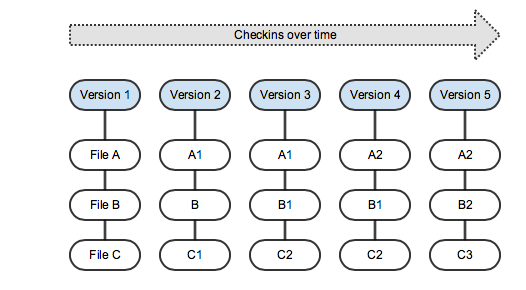

!SLIDE smbullets
# Git Basics

* Learn Git, forget about other VCS systems (SVN, etc.)
* Git interface is similar to existing VCS
* ... but Git behaves differently

~~~SECTION:handouts~~~

****

~~~ENDSECTION~~~

!SLIDE smbullets noprint
# Snapshots and Differences

* Information as a list of file-based changes
* File changes and deltas over time

!SLIDE smbullets printonly
# Snapshots and Differences

* Information as a list of file-based changes
* File changes and deltas over time

!SLIDE smbullets noprint
# Stream of Snapshots

* Set of snapshots of a mini-filesystem
* Git Commit, take snapshot, store reference to that snapshot
* No change - link to the previous identical stored file

!SLIDE smbullets printonly
# Stream of Snapshots

* Set of snapshots of a mini-filesystem
* Git Commit, take snapshot, store reference to that snapshot
* No change - link to the previous identical stored file

~~~SECTION:handouts~~~

****

~~~ENDSECTION~~~

!SLIDE smbullets
# Work locally

* No network latency involved as with other VCS systems
* Local repository clone, fast operations
 * Browse the history
 * Show differences between specific branches
* Work offline and push changes later

!SLIDE smbullets
# Integrity

* Everything has a check sum (SHA-1)
* No changes possible without Git knowing about them
* Checksums are literally used everywhere
* Revert changes and even restore deleted files

Example:

    7f0b824ba55e1fd4ffc5c461df0a0f48a94195cc

~~~SECTION:handouts~~~

****

~~~ENDSECTION~~~

!SLIDE smbullets
# The three states

* Three stages in your working directory:
 * Committed
 * Modified
 * Staged

~~~SECTION:notes~~~

`Committed` means that the data is safely stored in your local database.

`Modified` means that you have changed the file but have not committed
it to your Git database yet.

`Staged` means that you have marked a modified or added file in its
current version to go into your next commit snapshot.

~~~ENDSECTION~~~

~~~SECTION:handouts~~~

****

`Committed` means that the data is safely stored in your local database.

`Modified` means that you have changed the file but have not committed
it to your Git database yet.

`Staged` means that you have marked a modified or added file in its
current version to go into your next commit snapshot.

~~~ENDSECTION~~~

!SLIDE smbullets
# The three states

* Three main sections:
 * Git directory
 * Working directory
 * Staging area

~~~SECTION:notes~~~

The `Git directory` is where Git stores the metadata and object database
for your project. This is the most important part of Git, and it is what
is copied when you clone a repository from another computer.

The `working directory` is a single checkout of one version of the project.
These files are pulled out of the compressed database in the Git directory
and placed on disk for you to use or modify.

The `staging area` is a file, generally located in your Git directory, that
stores information about what will go into your next commit.
It is sometimes referred to as the "index", but it’s also common to refer
to it as the staging area.

~~~ENDSECTION~~~

~~~SECTION:handouts~~~

****

The `Git directory` is where Git stores the metadata and object database
for your project. This is the most important part of Git, and it is what
is copied when you clone a repository from another computer.

The `working directory` is a single checkout of one version of the project.
These files are pulled out of the compressed database in the Git directory
and placed on disk for you to use or modify.

The `staging area` is a file, generally located in your Git directory, that
stores information about what will go into your next commit.
It is sometimes referred to as the "index", but it’s also common to refer
to it as the staging area.

~~~ENDSECTION~~~

!SLIDE smbullets noprint
# Basic Git Workflow

* Modify files in `working directory`
* Stage the files, adding snapshots to the `staging area`
* Commit
 * Takes files in `staging area`
 * Stores snapshot permanently in `Git directory`

!SLIDE smbullets printonly
# Basic Git Workflow

* Modify files in `working directory`
* Stage the files, adding snapshots to the `staging area`
* Commit
 * Takes files in `staging area`
 * Stores snapshot permanently in `Git directory`

~~~PAGEBREAK~~~

~~~SECTION:handouts~~~

****

* If a particular version of a file is in the Git directory, it’s considered `committed`.
* `Staged` means that the file has been modified and it was added to the staging area
* `Modified` means that the file was changed since it was checked out but has not been staged yet.

~~~ENDSECTION~~~

