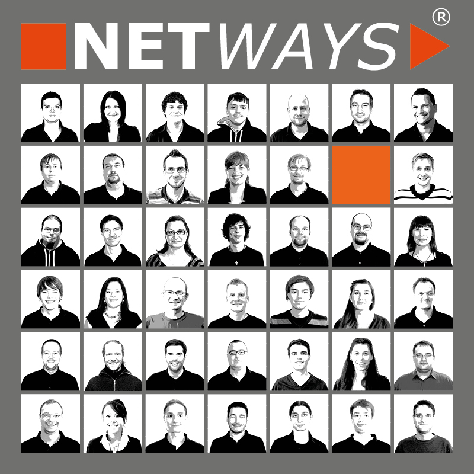
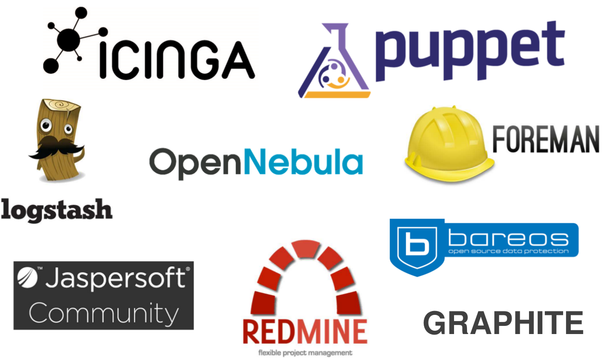
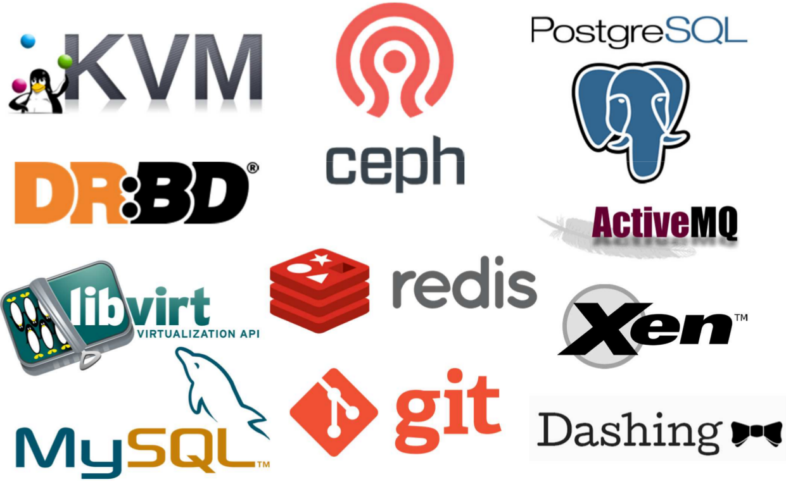
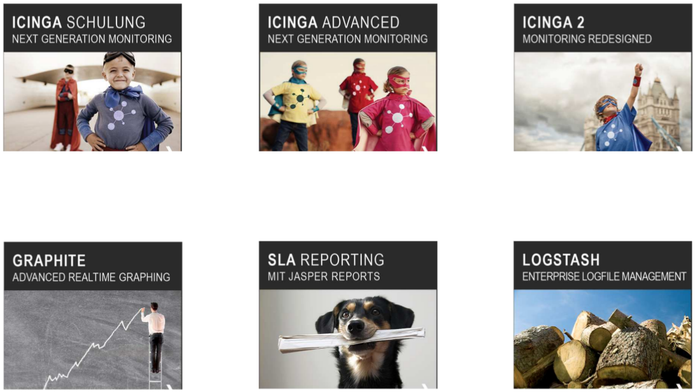
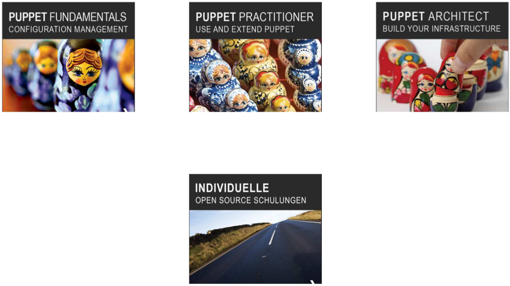
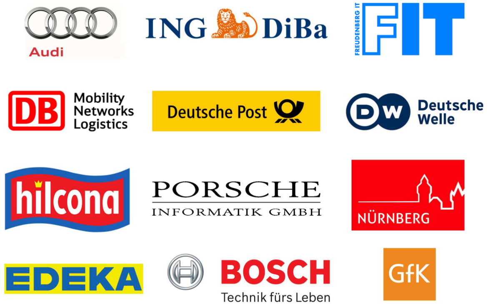
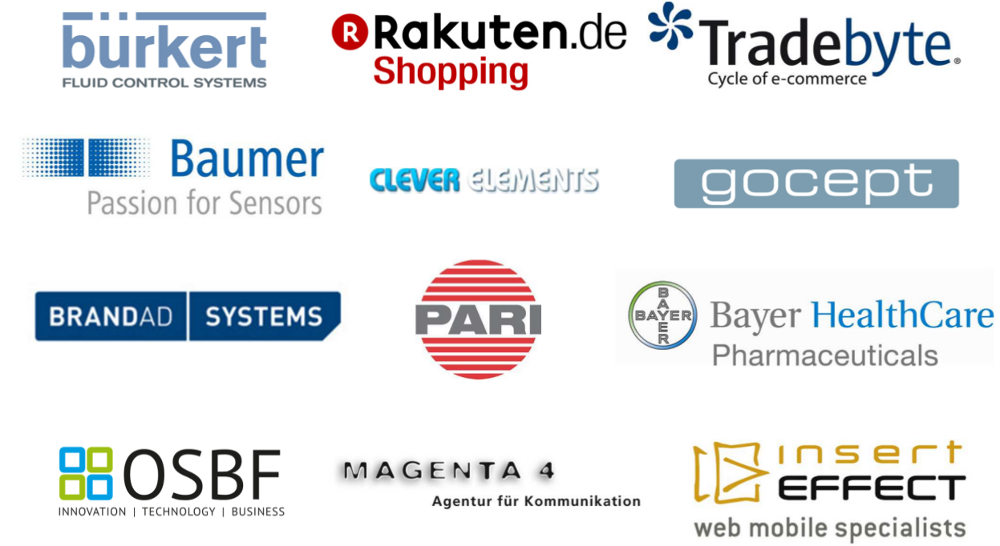

<!SLIDE subsection>
# INTRODUCTION NETWAYS

<!SLIDE img_right>
# INTRODUCTION NETWAYS

* Company foundation 1995
* Open Source since 1997
* Currently 40 employees
* Specializing in the areas of Open Source Systems Management and Open Source Datacenter
* Puppet Partner since 2009

<!SLIDE bullets_left-right>
# NETWAYS SKILLS

* Monitoring
* Graphing
* Logmanagement
* Configuration management
* Reporting
* Private Cloud
* Backup
* Project management
* Consulting
* Hosting
* Managed Services
* Development
* Support
* Operating
* Trainings
* Conferences
* Monitoring hardware

<!SLIDE single_img>
# NETWAYS PRODUCTS

<!SLIDE single_img>
# NETWAYS TECHNOLOGIES

<!SLIDE>
# NETWAYS CONFERENCES

<!SLIDE single_img>
# NETWAYS TRAININGS - MONITORING AND REPORTING

<!SLIDE single_img>
# NETWAYS TRAININGS - PUPPET CONFIGURATION MANAGEMENT

<!SLIDE>
# NETWAYS COMMUNITY

<!SLIDE single_img>
# NETWAYS CUSTOMERS - CONSULTING (EXCERPT)

<!SLIDE single_img>
# NETWAYS CUSTOMERS - HOSTING (EXCERPT)

<!SLIDE>
# OUR SERVICES AT A GLANCE

* Conceptual design and planning
* Workshops & Consulting with one-site implementation
* Operating
 * Complete monitoring systems
 * Satellite systems
* Development services
 * Plugins
 * System integration
* Trainings
 * Standardized training modules
 * Individual on-site
* Support
 * Standardized contracts
 * Individual support concepts
* Conferences
