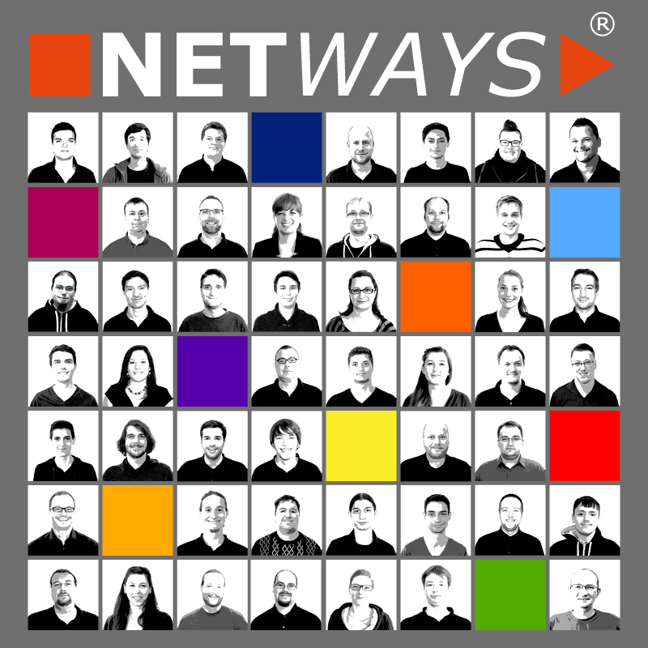
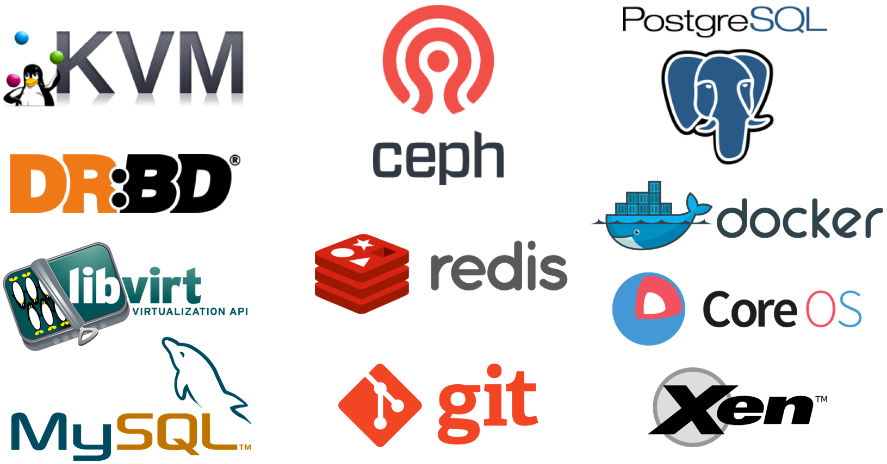
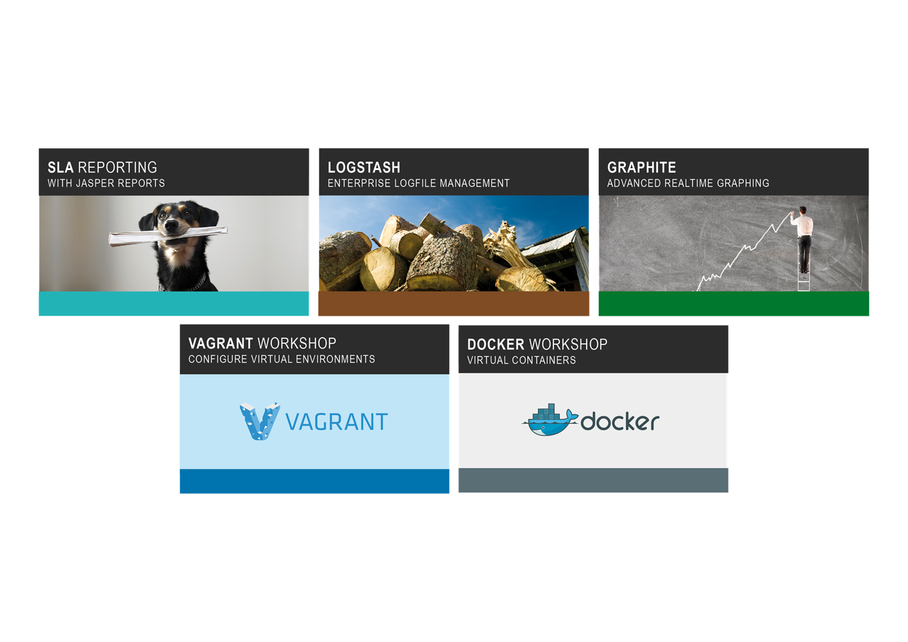
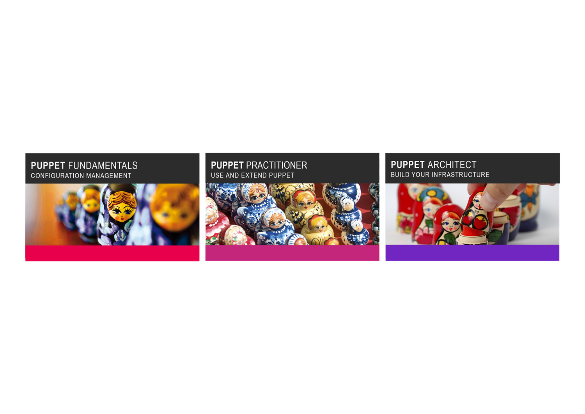

<!SLIDE noprint subsectionnonum>

# INTRODUCTION NETWAYS

<!SLIDE noprint smbullets rimg>

# INTRODUCTION NETWAYS

* Company foundation 1995
* Open Source since 1997
* Currently 47 employees
* Specializing in the areas of Open Source Systems Management and Open Source Datacenter

<!SLIDE noprint lrbullets smbullets>

# NETWAYS SKILLS

* Monitoring
* Graphing
* Logmanagement
* Configuration management
* Reporting
* Private Cloud
* Backup
* Project management
* Consulting
* Hosting
* Managed Services
* Development
* Support
* Operating
* Trainings
* Conferences
* Monitoring hardware

<!SLIDE noprint center>

# NETWAYS PRODUCTS

<!SLIDE noprint center>

# NETWAYS TECHNOLOGIES

<!SLIDE noprint smbullets small>

# NETWAYS CONFERENCES

* Open Source Data Center Conference
 * 26.-28. April 2016 in Berlin

* Open Source Backup Conference
 * 26.-27. September 2016 in Cologne

* Open Source Monitoring Conference
 * 29. November - 02. December 2016 in Nuremberg

<!SLIDE noprint center>

# NETWAYS TRAININGS - ICINGA 2 ENTERPRISE MONITORING

<!SLIDE noprint center>

# NETWAYS TRAININGS - SLA, LOGMANAGEMENT & GRAPHING

<!SLIDE noprint center>

# NETWAYS TRAININGS - PUPPET CONFIGURATION MANAGEMENT

<!SLIDE noprint smbullets small>

# NETWAYS COMMUNITY

* <a href="http://www.netways.org">www.netways.org</a>
 * NETWAYS Addons
 * NETWAYS Plugins

* <a href="https://www.icinga.org">www.icinga.org</a>
 * Development
 * Hosting

* <a href="https://exchange.icinga.org">exchange.icinga.org</a>
 * Icinga / Nagios Addons and Plugins
 * >500 Projects

* <a href="https://github.com/NETWAYS">github.com/NETWAYS</a>
 * NETWAYS Repositories for Softwaredevelopmentprojects

<!SLIDE noprint center>

# NETWAYS CUSTOMERS - CONSULTING (EXCERPT)

<!SLIDE noprint center>

# NETWAYS CUSTOMERS - HOSTING (EXCERPT)

<!SLIDE noprint smbullets small>

# OUR SERVICES AT A GLANCE

* Conceptual design and planning
* Workshops & Consulting with on-site implementation
* Operating
 * Complete monitoring systems
 * Satellite systems
* Development services
 * Plugins
 * System integration
* Trainings
 * Standardized training modules
 * Individual on-site

<!SLIDE noprint smbullets small>

# OUR SERVICES AT A GLANCE

* Support
 * Standardized contracts
 * Individual support concepts
* Conferences
