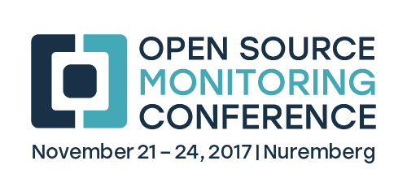

!SLIDE noprint subsectionnonum
# About NETWAYS

!SLIDE noprint smbullets
# About  NETWAYS

* Open Source Service Company
* Located in Nuremberg
* Currently 60 employees
* Specialised in
 * Open Source Systems Management
 * Open Source Datacenter
* Individual Open Source solutions

!SLIDE noprint
# NETWAYS Products

.margin-top-1-5 

!SLIDE noprint
# NETWAYS Consulting Customers (partly)

.margin-top-1-5 

!SLIDE noprint
# NETWAYS Hosting Customers (partly)

.margin-top-1-5 

!SLIDE noprint
# NETWAYS Events

.margin-top-1-5 

!SLIDE noprint smbullets
# NETWAYS Community

* <a href="http://www.netways.org">www.netways.org</a>
 * NETWAYS Addons
 * NETWAYS Plugins
* <a href="https://www.icinga.com">www.icinga.com</a>
 * Development
 * Hosting
* <a href="https://exchange.icinga.com">exchange.icinga.com</a>
 * Icinga / Nagios Addons and Plugins
 * Open for all platforms 
* <a href="https://github.com/NETWAYS">github.com/NETWAYS</a>
 * NETWAYS Repositories for Softwaredevelopmentprojects

!SLIDE noprint
# NETWAYS Trainings

.margin-top-1-5 

!SLIDE noprint smbullets
# NETWAYS Services

* Concepts and organisation
* Workshops & Consulting services (onsite implementation)
* Operational support
* Development
* Outsourcing
* Trainings
* Support
* Conferences / Events
