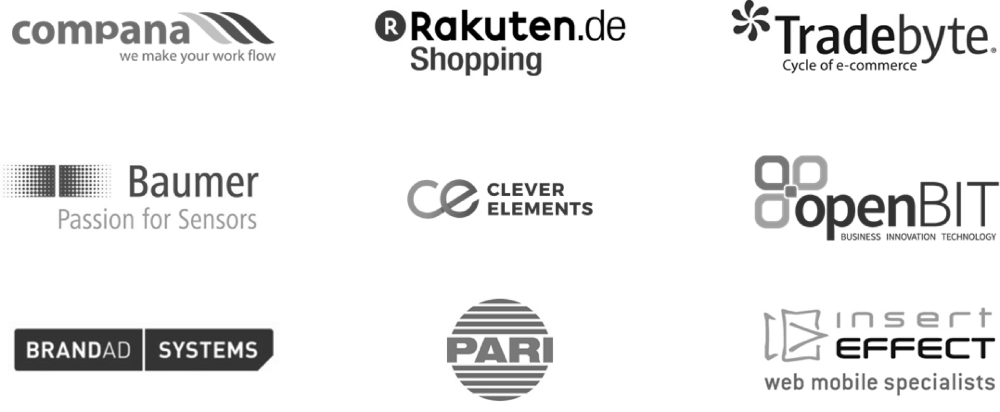

<!SLIDE noprint subsection>

# INTRODUCTION NETWAYS

<!SLIDE noprint smbullets rimg>

# INTRODUCTION NETWAYS

* Company foundation 1995
* Open Source since 1997
* Currently 40 employees
* Specializing in the areas of Open Source Systems Management and Open Source Datacenter
* Puppet Partner since 2009

<!SLIDE noprint lrbullets smbullets>

# NETWAYS SKILLS

* Monitoring
* Graphing
* Logmanagement
* Configuration management
* Reporting
* Private Cloud
* Backup
* Project management
* Consulting
* Hosting
* Managed Services
* Development
* Support
* Operating
* Trainings
* Conferences
* Monitoring hardware

<!SLIDE noprint center>

# NETWAYS PRODUCTS

<!SLIDE noprint center>

# NETWAYS TECHNOLOGIES

<!SLIDE noprint smbullets>

# NETWAYS CONFERENCES

* Open Source Data Center Conference
 * 22.-23. April 2015 in Berlin

* Puppet Camp
 * 24. April 2015 in Berlin

* Open Source Backup Conference
 * 29.-30. September 2015 in Cologne

* Open Source Monitoring Conference
 * 16.-18. November 2015 in Nuremberg

<!SLIDE noprint center>

# NETWAYS TRAININGS - MONITORING AND REPORTING

<!SLIDE noprint center>

# NETWAYS TRAININGS - PUPPET CONFIGURATION MANAGEMENT

<!SLIDE noprint smbullets>

# NETWAYS COMMUNITY

* www.netways.org
 * NETWAYS Addons
 * NETWAYS Plugins

* www.icinga.org
 * Development
 * Hosting

* exchange.icinga.org
 * Icinga / Nagios Addons and Plugins
 * >500 Projects

<!SLIDE noprint center>

# NETWAYS CUSTOMERS - CONSULTING (EXCERPT)

<!SLIDE noprint center>

# NETWAYS CUSTOMERS - HOSTING (EXCERPT)

<!SLIDE noprint smbullets small>

# OUR SERVICES AT A GLANCE

* Conceptual design and planning
* Workshops & Consulting with one-site implementation
* Operating
 * Complete monitoring systems
 * Satellite systems
* Development services
 * Plugins
 * System integration
* Trainings
 * Standardized training modules
 * Individual on-site
* Support
 * Standardized contracts
 * Individual support concepts
* Conferences
