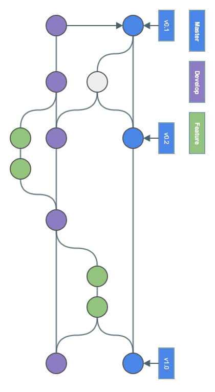
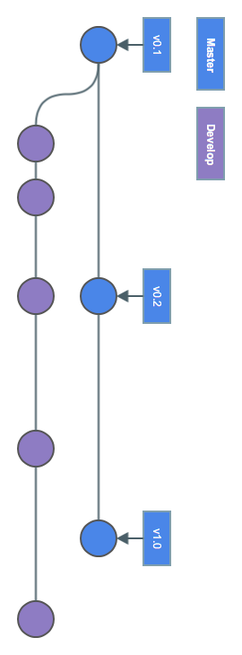
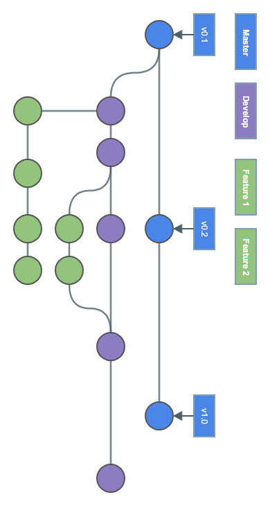
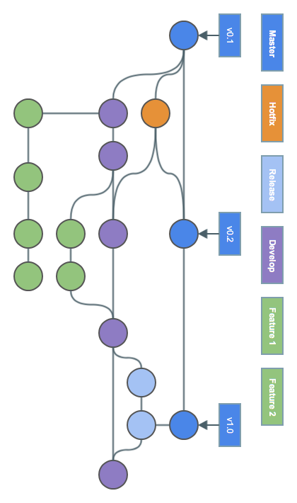

!SLIDE smbullets
# Gitflow Workflow

* Strict branching model for project releases
* Based on Feature Branch Workflow
* Assigns roles to different branches
* Defines interaction between branches for releases
 * Prepare
 * Maintain
 * Record

~~~SECTION:handouts~~~

****

~~~ENDSECTION~~~

!SLIDE smbullets noprint
# Gitflow Workflow

!SLIDE smbullets printonly
# Gitflow Workflow

!SLIDE smbullets noprint
# Gitflow Workflow - Historical Branches

* Master branch for release history (including version tags)
* Develop branch for feature integration

!SLIDE smbullets printonly
# Gitflow Workflow - Historical Branches

* Master branch for release history (including version tags)
* Develop branch for feature integration

~~~SECTION:handouts~~~

****

~~~ENDSECTION~~~

!SLIDE smbullets noprint
# Gitflow Workflow - Feature Branches

* New features in their own branches
* Feature branches use `develop` as their parent branch
* Once completed, merged back to `develop`

!SLIDE smbullets printonly
# Gitflow Workflow - Feature Branches

* New features in their own branches
* Feature branches use `develop` as their parent branch
* Once completed, merged back to `develop`

~~~SECTION:handouts~~~

****

~~~ENDSECTION~~~

!SLIDE smbullets noprint
# Gitflow Workflow - Release Branches

* Enough features in `develop`: `release` branch based on `develop`
* Ready to ship: merged to `master` and tagged with version

!SLIDE smbullets printonly
# Gitflow Workflow - Release Branches

* Enough features in `develop`: `release` branch based on `develop`
* Ready to ship: merged to `master` and tagged with version

~~~SECTION:handouts~~~

****

~~~ENDSECTION~~~

!SLIDE smbullets noprint
# Gitflow Workflow - Maintenance Branches

* Fixes based on `master`
* Merged to `master`, tagged and merged to `develop`

!SLIDE smbullets printonly
# Gitflow Workflow - Maintenance Branches

* Fixes based on `master`
* Merged to `master`, tagged and merged to `develop`

~~~SECTION:handouts~~~

****

~~~ENDSECTION~~~

