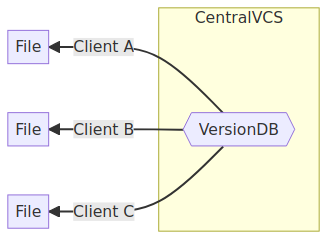

!SLIDE subsection
# ~~~SECTION:MAJOR~~~ Git Introduction

!SLIDE smbullets
# Why use Version Control Systems?

* Version Control Systems (VCS) track changes over time
* They track who changed what and when
* Changes can be compared, reverted, coordinated with others

Usually VCS are used for source code, text documents, web sites, or other text data.

There are also data VCS for data science or machine learning projects.

~~~SECTION:handouts~~~

****

The most simple version control system is to copy
directories and add a suffix like the last date it
worked. Though this might cause trouble when you're
in the wrong directory. Afterall it pollutes your
filesystem structure over time.

Long time ago developers invented version control
systems which store the file revisions in a database.

~~~ENDSECTION~~~

!SLIDE noprint
# Centralized and Distributed VCS

* Central VCS
  * A central system contains the *version database*, clients work on this system
  * Examples: CVS, Subversion
* Decentral VCS
  * Clients mirror the *version database* from a central system and work locally
  * Examples: Git, Mercurial

<table>
  <tbody>
    <tr>
      <td>

</td>
      <td>

</td>
    </tr>
  </tbody>
</table>

!SLIDE smbullets printonly
# Centralized and Distributed VCS

* Central VCS
  * A central system contains the *version database*, clients work on this system
  * Examples: CVS, Subversion

* Decentral VCS
  * Clients mirror the *version database* from a central system and work locally
  * Examples: Git, Mercurial

!SLIDE
# The History of Git

Git was developed by the Linux kernel team in 2005.

* They originally used BitKeeper, a closed-source commercial tool
* They created Git due to some controversy with BitKeeper

Their design goals:

* A fully distributed VCS
* Speed (when working with huge numbers of files)
* Simple design
* Non-linear development (branching)

Git has become a de facto standard for version control.

!SLIDE smbullets
# The Git Workflow is local

In Git we `clone` the data to our local system and work locally.

* No network latency involved as with other VCS systems
* Faster operations due to the local data
* We can work offline and push changes later (i.e. when traveling)
