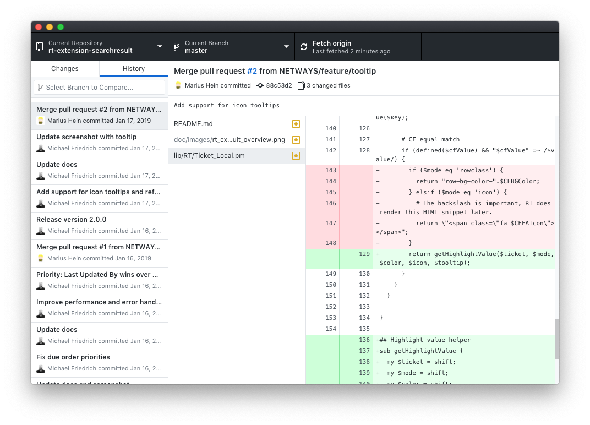

!SLIDE smbullets
# Git GUI Clients

In this training, we will work with the command-line interface.

These are a few recommendations for graphical clients:

* Sourcetree (Windows, macOS)
* GitKraken (Windows, Linux, macOS)
* TortoiseGit (Windows)
* GitExtensions (Windows)
* GitHub Desktop (Windows, macOS)

~~~SECTION:handouts~~~

****

Additional GUI clients can be found here:

* https://git-scm.com/download/gui/linux
* https://gitextensions.github.io/

~~~ENDSECTION~~~

!SLIDE smbullets noprint
# Git GUI Clients: Sourcetree

!SLIDE smbullets printonly
# Git GUI Clients: Sourcetree

~~~SECTION:handouts~~~

****

Download: https://www.sourcetreeapp.com/

~~~ENDSECTION~~~

!SLIDE smbullets noprint
# Git GUI Clients: Gitkraken

!SLIDE smbullets printonly
# Git GUI Clients: Gitkraken

~~~SECTION:handouts~~~

****

Download: https://www.gitkraken.com/

~~~ENDSECTION~~~

!SLIDE smbullets noprint
# Git GUI Clients: GitHub Desktop

!SLIDE smbullets printonly
# Git GUI Clients: GitHub Desktop

~~~SECTION:handouts~~~

****

Download: https://desktop.github.com/

~~~ENDSECTION~~~
