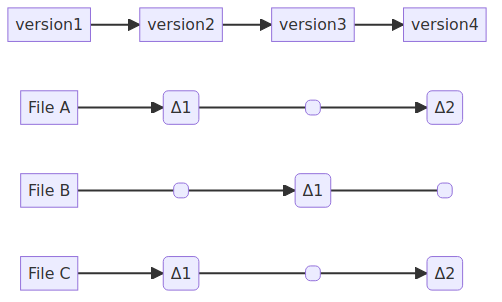

!SLIDE smbullets
# When coming from another VCS

* If you have knowledge about other VCS - try to put it aside
* A lot of commands sound similar but work differently in git
  * A `git commit` is not the same as an `svn commit`

~~~SECTION:handouts~~~

****

~~~ENDSECTION~~~

!SLIDE smbullets noprint
# Snapshots and Differences

* File changes and deltas over time
  * Git Commit, take snapshot, store reference to that snapshot
  * Set of snapshots of a mini-filesystem
  * No change - link to the previous identical stored file

!SLIDE smbullets printonly
# Snapshots and Differences

* File changes and deltas over time
  * Git Commit, take snapshot, store reference to that snapshot
  * Set of snapshots of a mini-filesystem
  * No change - link to the previous identical stored file

!SLIDE smbullets noprint
# The three states

* Working directory ("modified")
* Staging area ("staged")
* Git directory ("committed")

!SLIDE smbullets printonly
# The three states

* Working directory ("modified")
* Staging area ("staged")
* Git directory ("committed")

~~~SECTION:notes~~~

`Modified` means that you have changed the file but have not committed
it to your Git database yet.

`Staged` means that you have marked a modified or added file in its
current version to go into your next commit snapshot.

`Committed` means that the data is safely stored in your local database.

The `working directory` is a single checkout of one version of the project.
These files are pulled out of the compressed database in the Git directory
and placed on disk for you to use or modify.

The `staging area` is a file, generally located in your Git directory, that
stores information about what will go into your next commit.
It is sometimes referred to as the "index", but it’s also common to refer
to it as the staging area.

The `Git directory` is where Git stores the metadata and object database
for your project. This is the most important part of Git, and it is what
is copied when you clone a repository from another computer.

~~~ENDSECTION~~~

~~~SECTION:handouts~~~

****

`Modified` means that you have changed the file but have not committed
it to your Git database yet.

`Staged` means that you have marked a modified or added file in its
current version to go into your next commit snapshot.

`Committed` means that the data is safely stored in your local database.

The `working directory` is a single checkout of one version of the project.
These files are pulled out of the compressed database in the Git directory
and placed on disk for you to use or modify.

The `staging area` is a file, generally located in your Git directory, that
stores information about what will go into your next commit.
It is sometimes referred to as the "index", but it’s also common to refer
to it as the staging area.

The `Git directory` is where Git stores the metadata and object database
for your project. This is the most important part of Git, and it is what
is copied when you clone a repository from another computer.

~~~ENDSECTION~~~

!SLIDE smbullets
# Basic Git Workflow

* Modify files in `working directory`
* Stage the files which add snapshots to the `staging area` ("git add")
* Commit ("git commit")
 * Takes files from `staging area`
 * Stores snapshot permanently in `.git directory`

~~~SECTION:handouts~~~

****

* If a particular version of a file is in the `.git directory`, it’s considered `committed`

* `Staged` means that the file has been modified and it was added to the staging area

* `Modified` means that the file was changed since it was checked out but has not been staged yet

~~~ENDSECTION~~~

!SLIDE smbullets
# The Git Workfow is local

* No network latency involved as with other VCS systems
* Local repository clone, fast operations
 * Browse the history
 * Show differences between specific branches
* Work offline and push changes later

!SLIDE smbullets
# Git Object Integrity

* Everything has a checksum (SHA)
* No changes possible without Git knowing about them
* Checksums are used everywhere
* Revert changes and even restore deleted files

Example:

    7f0b824ba55e1fd4ffc5c461df0a0f48a94195cc

~~~SECTION:handouts~~~

****

~~~ENDSECTION~~~
