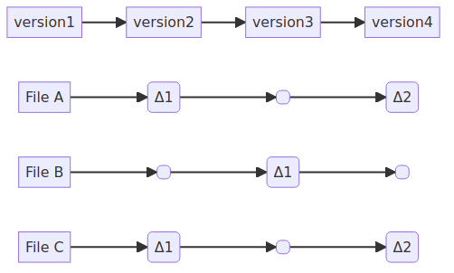
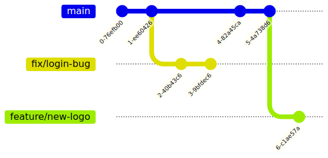
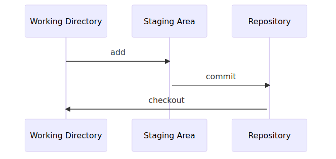

!SLIDE smbullets
# Core Concepts of Git

* All work is done in a **repository**, it contains our files
* Snapshots track changes in these file, these are called **commits**
* A chain of these commits is called a **branch**

Analogy: Writing on a desk or packing a parcel.

!SLIDE smbullets
# Git Commit

A Commit is a snapshot in time, containing: an author, a timestamp and the current state of the files.

Git stores compressed snapshots (aka BLOBs) of the files, not diffs. It keeps track of changes with checksums (SHA) of these BLOBs.

If a file does not change between commits, Git just refers back to the previous commit.

!SLIDE smbullets
# Git Branch

Since each commit has a pointer to the commit directly before it (its parent), they form a chain (or linked list).

This chain is called a branch.

Branches represent an isolated line of development.

!SLIDE
# The Three States

Files in a repository go through three states before being version controlled.

* Working directory ("modified")
* Staging area ("staged")
* Git directory ("committed")

~~~SECTION:handouts~~~

****

`Modified` means that you have changed the file but have not committed
it to your Git database yet.

`Staged` means that you have marked a modified or added file in its
current version to go into your next commit snapshot.

`Committed` means that the data is safely stored in your local database.

The `working directory` is a single checkout of one version of the project.
These files are pulled out of the compressed database in the Git directory
and placed on disk for you to use or modify.

The `staging area` is a file, generally located in your Git directory, that
stores information about what will go into your next commit.
It is sometimes referred to as the "index", but it’s also common to refer
to it as the staging area.

The `Git directory` is where Git stores the metadata and object database
for your project. This is the most important part of Git, and it is what
is copied when you clone a repository from another computer.

~~~ENDSECTION~~~

!SLIDE smbullets
# The Git Commit Workflow

* Modify files in the `working directory`
* Stage the files in the `staging area` ("git add") to prepare a commit
* Create a snapshot ("git commit")
 * Takes all files from the `staging area`
 * Stores the snapshot permanently in the `.git directory`

~~~SECTION:handouts~~~

****

* If a particular version of a file is in the `.git directory`, it’s considered `committed`

* `Staged` means that the file has been modified and it was added to the staging area

* `Modified` means that the file was changed since it was checked out but has not been staged yet

~~~ENDSECTION~~~
