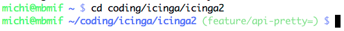

!SLIDE smbullets
# Git Installation

* Available as package
* macOS, Windows installers
* Bash Integration
  * Completion
  * Show status and branch in the terminal

~~~SECTION:handouts~~~

****

~~~ENDSECTION~~~

!SLIDE smbullets
# Lab ~~~SECTION:MAJOR~~~.~~~SECTION:MINOR~~~: Install Git

* Objective:
 * Install the `git` package
* Steps:
 * Use the package manager to install the git package

~~~SECTION:handouts~~~

****

~~~ENDSECTION~~~

!SLIDE supplemental exercises
# Lab ~~~SECTION:MAJOR~~~.~~~SECTION:MINOR~~~: Install Git

## Objective: Install the Git package
****

* Install the `git` package

## Steps:

****

* Use the package manager to install the git package

!SLIDE supplemental solutions
# Lab ~~~SECTION:MAJOR~~~.~~~SECTION:MINOR~~~: Proposed Solution
****

## Install the Git package

****

### Example for Debian/Ubuntu

    @@@ Sh
    $ apt-get install git

### Example for RHEL/CentOS

    @@@ Sh
    $ yum install git

### Example for Fedora

    @@@ Sh
    $ dnf install git

!SLIDE smbullets
# Lab ~~~SECTION:MAJOR~~~.~~~SECTION:MINOR~~~: Install Git Bash Completion

* Objective:
 * Install the `bash-completion` package
 * Modify your prompt to highlight the git state
* Steps:
 * Use the package manager to install the `bash-completion` package
 * Fetch the `git-prompt.sh` script from https://github.com/git/git - `contrib/completion/git-prompt.sh`
 * Customize your prompt in your `$HOME/.bashrc` file

.download share/git-prompt.sh
.download share/bashrc

~~~SECTION:notes~~~

Files can be downloaded from http://localhost:9090/download

~~~ENDSECTION~~~

~~~SECTION:handouts~~~

****

~~~ENDSECTION~~~

!SLIDE supplemental exercises
# Lab ~~~SECTION:MAJOR~~~.~~~SECTION:MINOR~~~: Install Git

## Objective: Install the Git package
****

* Install the `bash-completion` package
* Modify your prompt to highlight the git state

## Steps:

****

* Use the package manager to install the `bash-completion` package
* Fetch the `git-prompt.sh` script from https://raw.githubusercontent.com/git/git/master/contrib/completion/git-prompt.sh
* Customize your prompt
* Persist changes in your .bashrc file

!SLIDE supplemental solutions
# Lab ~~~SECTION:MAJOR~~~.~~~SECTION:MINOR~~~: Proposed Solution
****

## Install Git Bash Completion

****

### Example for Debian/Ubuntu

    @@@ Sh
    $ apt-get install bash-completion

### Example for RHEL/CentOS

    @@@ Sh
    $ yum install bash-completion

### Example for Fedora

    @@@ Sh
    $ dnf install bash-completion

### Fetch the git-prompt.sh script

    @@@ Sh
    $ wget https://raw.githubusercontent.com/git/git/master/contrib/completion/git-prompt.sh

### Customize your prompt in your .bashrc file

    @@@ Sh
    $ vim $HOME/.bashrc
    source ~/git-prompt.sh
    export GIT_PS1_SHOWDIRTYSTATE=1
    export PS1='[\u@\h] \W$(__git_ps1 " (%s)") \$ '

    $ source $HOME/.bashrc

