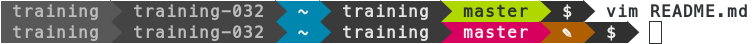
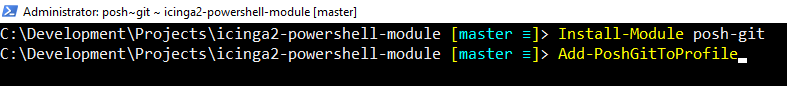

!SLIDE smbullets noprint
# Git Installation

* Available as package
* macOS, Windows installers
* Bash Integration
  * Completion
  * Show status and branch in the terminal

Example:

<code>training@netways ~$ cd git/icinga</code>

<code>training@netways ~/git/icinga (fix/issue-5=) $ ls</code>

!SLIDE smbullets printonly
# Git Installation

* Available as package
* macOS, Windows installers
* Bash Integration
  * Completion
  * Show status and branch in the terminal

Example:

<code>training@netways ~$ cd git/icinga</code>

<code>training@netways ~/git/icinga (fix/issue-5=) $ ls</code>

~~~SECTION:handouts~~~

****

~~~ENDSECTION~~~

!SLIDE smbullets
# Lab ~~~SECTION:MAJOR~~~.~~~SECTION:MINOR~~~: Install Git

* Objective:
 * Install the `git` package
* Steps:
 * Use the package manager to install the git package

~~~SECTION:handouts~~~

****

~~~ENDSECTION~~~

!SLIDE supplemental exercises
# Lab ~~~SECTION:MAJOR~~~.~~~SECTION:MINOR~~~: Install Git

## Objective: Install the Git package
****

* Install the `git` package

## Steps:

****

* Use the package manager to install the git package

!SLIDE supplemental solutions
# Lab ~~~SECTION:MAJOR~~~.~~~SECTION:MINOR~~~: Proposed Solution
****

## Install the Git package

****

### Example for Debian/Ubuntu

    @@@ Sh
    $ apt-get install git

### Example for RHEL/CentOS

    @@@ Sh
    $ yum install git

### Example for Fedora

    @@@ Sh
    $ dnf install git

!SLIDE smbullets small
# Lab ~~~SECTION:MAJOR~~~.~~~SECTION:MINOR~~~: Install Git Bash Integration

* Objective:
 * Install bash completion and Git status
* Steps:
 * Use the package manager to install the `bash-completion` package
 * Fetch the `git-prompt.sh` script from https://github.com/git/git - `contrib/completion/git-prompt.sh`
 * Customize your prompt in your `$HOME/.bashrc` file

Example:

    $ vim $HOME/.bashrc
    source ~/git-prompt.sh
    export GIT_PS1_SHOWDIRTYSTATE=1
    export PS1='[\u@\h] \W$(__git_ps1 " (%s)") \$ '

    $ source $HOME/.bashrc

~~~SECTION:notes~~~

~~~ENDSECTION~~~

~~~SECTION:handouts~~~

****

The training notebooks come pre-provisioned with this `.bashrc` configuration:

    @@@ Sh
    vim $HOME/.bashrc

    # Enable Git branch and modifications in colored terminal
    #
    # Adopted from Michael Friedrich's dev environment.
    
    # requires git bash completion
    source /etc/bash_completion.d/git
    # CentOS 7 specific (!)
    source /usr/share/git-core/contrib/completion/git-prompt.sh
    
    # global options
    export GIT_PS1_SHOWDIRTYSTATE=1
    #export GIT_PS1_SHOWSTASHSTATE='y'
    #export GIT_PS1_SHOWUNTRACKEDFILES='y'
    #export GIT_PS1_DESCRIBE_STYLE='contains'
    export GIT_PS1_SHOWUPSTREAM='git'
    
    function myPrompt() {
            local GREEN_BOLD="\[\033[01;32m\]"
            local RED_BOLD="\[\033[01;31m\]"
            local BLUE_BOLD="\[\033[01;34m\]"
            local GREEND="\[\033[02;32m\]"
            local REDD="\[\033[02;32m\]"
            local DEFAULT="\[\033[00m\]"
    
            # \h ... hostname
            # \w ... workdir
            # \$? ... RC
            # \u ... user
            # \$(formattedGitBranch) ... git branch if available
    
            local USER_BOLD=$GREEN_BOLD
            local USERD=$GREEND
            local USERAT="\u@\h"
            local USERHASH="\$"
    
            if [ `/usr/bin/whoami` = 'root' ]
            then
                    USER_BOLD=$RED_BOLD
                    USERD=$REDD
                    USERAT="\h"
                    USERHASH="#"
            fi
    
            PS1="$USER_BOLD$USERAT$DEFAULT $BLUE_BOLD\w$DEFAULT"
            PS1=$PS1"$DEFAULT$GREEND\$(__git_ps1)$BLUE_BOLD $USERHASH $DEFAULT"
    
            # window title
            case "$TERM" in
                    xterm*|rxvt*)
                            PS1="\[\e]0;\h: \w (\u)\a\]$PS1"
                            ;;
            esac
    }

# set git colored prompt based on uid
myPrompt

~~~ENDSECTION~~~

!SLIDE supplemental exercises
# Lab ~~~SECTION:MAJOR~~~.~~~SECTION:MINOR~~~: Install Git Bash Integration

## Objective: Install the Git Bash Integration
****

* Install the `bash-completion` package
* Modify your prompt to highlight the git state

## Steps:

****

* Use the package manager to install the `bash-completion` package
* Fetch the `git-prompt.sh` script from https://raw.githubusercontent.com/git/git/master/contrib/completion/git-prompt.sh
* Customize your prompt
* Persist changes in your .bashrc file

!SLIDE supplemental solutions
# Lab ~~~SECTION:MAJOR~~~.~~~SECTION:MINOR~~~: Proposed Solution
****

## Install Git Bash Integration

****

### Example for Debian/Ubuntu

    @@@ Sh
    $ apt-get install bash-completion

### Example for RHEL/CentOS

    @@@ Sh
    $ yum install bash-completion

### Example for Fedora

    @@@ Sh
    $ dnf install bash-completion

### Fetch the git-prompt.sh script

    @@@ Sh
    $ wget https://raw.githubusercontent.com/git/git/master/contrib/completion/git-prompt.sh

### Customize your prompt in your .bashrc file

Additional configuration settings can be found
in the source code documentation at https://github.com/git/git/blob/master/contrib/completion/git-prompt.sh#L38

    @@@ Sh
    $ vim $HOME/.bashrc
    source ~/git-prompt.sh
    export GIT_PS1_SHOWDIRTYSTATE=1
    export PS1='[\u@\h] \W$(__git_ps1 " (%s)") \$ '

    $ source $HOME/.bashrc

!SLIDE smbullets noprint
# More Git Shell Integrations

Powerline Shell

Windows Powershell: git-posh

!SLIDE smbullets printonly
# More Git Shell Integrations

Powerline Shell

Windows Powershell: git-posh

~~~SECTION:handouts~~~

****

### Powerline Shell Integration

The Powerline shell integration can be found here: https://github.com/b-ryan/powerline-shell

    @@@ Sh
    # yum -y install epel-release
    # yum -y install python-pip
    # pip install powerline-shell

    @@@ Sh
    $ vim $HOME/.bashrc

    function _update_ps1() {
        PS1=$(powerline-shell $?)
    }

    if [[ $TERM != linux && ! $PROMPT_COMMAND =~ _update_ps1 ]]; then
        PROMPT_COMMAND="_update_ps1; $PROMPT_COMMAND"
    fi

Powerline needs an additional font which can be downloaded from here:
https://github.com/powerline/fonts/blob/master/Meslo%20Slashed/Meslo%20LG%20M%20Regular%20for%20Powerline.ttf

Choose `Raw` and install it into your system.

Modify your terminal profile settings and choose `Meslo LG` as font.

### Windows Powershell Integration

The Windows Powershell integration requires NuGet. Open a new Powershell prompt and enter:

    @@@ Sh
    Install-Module git-posh
    Add-PoshGitToProfile

~~~ENDSECTION~~~
