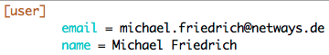

!SLIDE smbullets
# Configuration

* CLI command support
* $HOME/.gitconfig

Example:

    @@@ Sh
    $ git config --global color.ui auto

    $ cat $HOME/.gitconfig
    [color]
    ui = auto

~~~SECTION:handouts~~~

****

More information can be found in the documentation at
https://git-scm.com/book/tr/v2/Customizing-Git-Git-Configuration

~~~ENDSECTION~~~

!SLIDE smbullets
# Configuration Sections

* Commit author (`user`)
* Aliases (`alias`)
* Colors for diff and verbose commit (`color`)
* Core functionality (`core`)

Example:

~~~SECTION:handouts~~~

****

~~~ENDSECTION~~~

!SLIDE smbullets
# Lab ~~~SECTION:MAJOR~~~.~~~SECTION:MINOR~~~: Configure your username and email address

* Objective:
 * Configure your username and email address using Git CLI commands
* Steps:
 * Use `git config --global user.name "Your Name"`
 * Use `git config --global user.email "name@domain.com"`
* Next steps:
 * Verify the changes with `git config --list`

!SLIDE supplemental exercises
# Lab ~~~SECTION:MAJOR~~~.~~~SECTION:MINOR~~~: Configure your username and email address

## Objective: Configure your username and email address
****

* Configure your username and email address using Git CLI commands

## Steps:

****

* Use `git config --global user.name "Your Name"`
* Use `git config --global user.email "name@domain.com"`
* Verify the changes with `git config --list`

!SLIDE supplemental solutions
# Lab ~~~SECTION:MAJOR~~~.~~~SECTION:MINOR~~~: Proposed Solution
****

## Configure your username and email address

****

### Set the global username

    @@@ Sh
    $ git config --global user.name "Michael Friedrich"

### Set the global email address

    @@@ Sh
    $ git config --global user.email "michael.friedrich@netways.de"

### Verification

    @@@ Sh
    $ git config --list

In addition to that you can open the `.gitconfig` file in your $HOME directory.

    $ less $HOME/.gitconfig

### Notes

You can also use `git config --list` to list all configured options.

