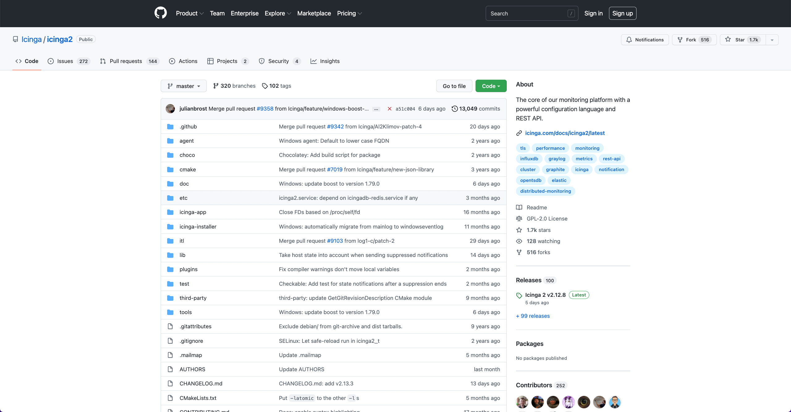

!SLIDE subsection
# ~~~SECTION:MAJOR~~~ Git Server

!SLIDE smbullets
# Introduction

* Central storage for repositories
* Collaboration between teams
* User based access control
* Trigger events (e.g. for CI)

~~~SECTION:handouts~~~

****

There is a variety of Git server tools, web interfaces
and addons out there.

* GitLab
* gitosis
* gitolite

In case you don't want to host your own Git server,
there are public services such as GitHub, GitLab or Bitbucket.

~~~ENDSECTION~~~
!SLIDE smbullets
# Git Server Overview

* Git server daemon
* Web interfaces
* Entire collaboration suites
  * GitHub
  * GitLab
  * Bitbucket

~~~SECTION:handouts~~~

****

There is a variety of Git server tools, web interfaces
and addons out there.

* GitLab
* gitosis
* gitolite

In case you don't want to host your own Git server,
there are public services such as GitHub, GitLab or Bitbucket.

~~~ENDSECTION~~~

!SLIDE smbullets noprint
# GitHub

!SLIDE smbullets printonly
# GitHub

!SLIDE smbullets noprint
# GitLab

!SLIDE smbullets printonly
# GitLab

!SLIDE smbullets
# Git Server Protocol

* Local protocol
  * `file:///opt/git/repo.git`
* Git protocol
  * `git://domain.com/repo.git`
* Read/write access via SSH
  * `git@domain.com:repo.git`
* HTTPS protocol (write access via oauth tokens)
  * `https://github.com/NETWAYS/graphing-training.git`

