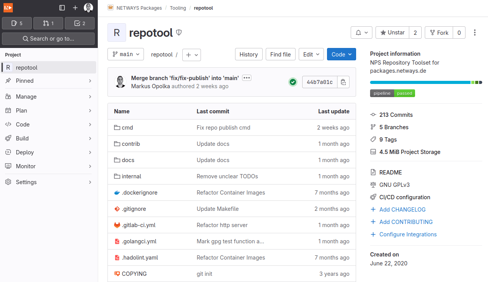

!SLIDE subsection
# ~~~SECTION:MAJOR~~~ Git Server

!SLIDE smbullets
# Git Server Overview

* Git server
* Web interfaces
* Entire collaboration suites

~~~SECTION:handouts~~~

****

There is a variety of Git server tools, web interfaces
and addons out there.

* GitLab
* gitosis
* gitolite

In case you don't want to host your own Git server,
there are public services such as Github, GitLab or Bitbucket.

~~~ENDSECTION~~~

!SLIDE smbullets noprint
# Git Web

!SLIDE smbullets printonly
# Git Web

!SLIDE smbullets noprint
# GitHub

!SLIDE smbullets printonly
# GitHub

!SLIDE smbullets noprint
# GitLab

!SLIDE smbullets printonly
# GitLab

!SLIDE smbullets
# Git Server Protocol

* Local protocol
* Read/write access via SSH
* Git protocol
* HTTPS protocol

