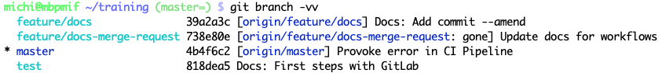

!SLIDE smbullets
# Collaboration: Put History

* `git push`
  * Update remote references and push local history to remote repository.
  * This pushes source code changes and commits.
  * Halts if the remote history diverged from your local history.
* `git remote`
  * Configure/list remote repository URLs (default `origin`).
* `git branch -r`
  * List remote branches, prefixed with the remote name, e.g. `origin/master`.

~~~SECTION:handouts~~~

****

`git push` updates remote references and pushes your local commit history to the remote repository.

`git remote` allows you to configure and list the remote repository. By default this is called `origin`.

~~~ENDSECTION~~~

!SLIDE smbullets
# Lab ~~~SECTION:MAJOR~~~.~~~SECTION:MINOR~~~: Learn more about git push

* Objective:
 * Learn more about git push
* Steps:
 * Change into `$HOME/training`
 * Edit `README.md` and add a note on `git push`
 * Add and commit the changes
 * Push the changes
* Bonus:
 * List all remote branches with `git branch -r`

~~~SECTION:handouts~~~

****

~~~ENDSECTION~~~

!SLIDE supplemental exercises
# Lab ~~~SECTION:MAJOR~~~.~~~SECTION:MINOR~~~: Learn more about git push

## Objective: Learn more about git push
****

* Learn more about git push

## Steps:

* Change into `$HOME/training`
* Edit `README.md` and add a note on `git push`
* Add and commit the changes
* Push the changes

## Bonus:

* List all remote branches with `git branch -r`

!SLIDE supplemental solutions
# Lab ~~~SECTION:MAJOR~~~.~~~SECTION:MINOR~~~: Proposed Solution
****

## Learn more about git push

****

### Make changes

    @@@ Sh
    $ cd $HOME/training
    $ git checkout master

    $ vim README.md

    Now I know how to publish my changes to my NWS hosted GitLab server.

    $ git add README.md
    $ git commit -v README.md -m "Add docs for git push"

### Push changes

    @@@ Sh
    $ git push origin master

### List remote branches

    @@@ Sh
    $ git branch -r

!SLIDE smbullets
# Collaboration: Branch Tracking

* Local branches track remote branches
* Use same names for local and remote branches
 * Enables "simple" push with `git push` in the current checked out branch
* `git branch -a` lists all branches
* Use `git branch -vv` to list tracking

~~~SECTION:handouts~~~

****

~~~ENDSECTION~~~

!SLIDE smbullets
# Collaboration: Get History

* `git fetch`
  * Update the remote branch reference pointers to the latest commit and cache it locally.
  * Does not pull in any remote commit history.
* `git pull`
  * Fetch and update the local history from remote repository (implicit fetch).
  * This pulls in source code changes and commits.

~~~SECTION:handouts~~~

****

`git fetch` downloads objects and references from another remote repository.

`git pull` invokes a fetch and updates the local history with commits from the remote repository.

~~~ENDSECTION~~~

!SLIDE smbullets
# Lab ~~~SECTION:MAJOR~~~.~~~SECTION:MINOR~~~: Learn more about git fetch and git pull

* Objective:
 * Learn more about git fetch and git pull
* Steps:
 * Go to your project repository in GitLab
 * Edit the `README.md` in your browser and commit the change to master
 * Run `git fetch` and explain `git diff master origin/master`
 * Run `git pull`
 * Explain the difference

~~~SECTION:handouts~~~

****

~~~ENDSECTION~~~

!SLIDE supplemental exercises
# Lab ~~~SECTION:MAJOR~~~.~~~SECTION:MINOR~~~: Learn more about git fetch and git pull

## Objective: Learn more about git fetch and git pull
****

* Learn more about git fetch and git pull

## Steps:

* Go to your project repository in GitLab
* Edit the `README.md` in your browser and commit the change to master
* Run `git fetch` and explain `git diff master origin/master`
* Run `git pull`
* Explain the difference

## Bonus:

* Repeat push and pull multiple times

!SLIDE supplemental solutions
# Lab ~~~SECTION:MAJOR~~~.~~~SECTION:MINOR~~~: Proposed Solution
****

## Learn more about git fetch and git pull

****

### Go to GitLab, edit README.md and commit the change

Navigate into the `training` project and choose `Repository`.

Click on the `README.md` file and choose to `edit` it directly.
Add some documentation like `This change was done via GitLab web.`.

Stage and commit the change directly to master.

### Fetch changes

Change to the CLI again and fetch the changes.

    @@@ Sh
    $ git fetch

Compare this with your local commit history - you'll see that there are
not changes pulled yet.

    @@@ Sh
    $ git log
    $ git diff master origin/master

### Pull changes

    @@@ Sh
    $ git pull

Check the local commit history - now your local history has been
updated with the remote history.

    @@@ Sh
    $ git log
    $ git diff master origin/master

