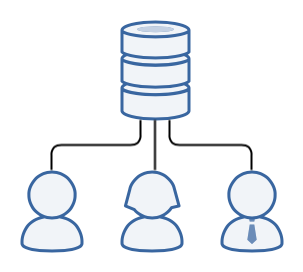
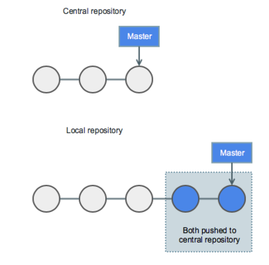
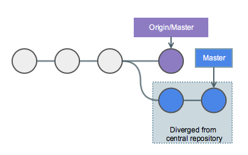
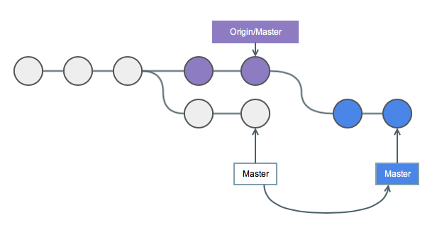

!SLIDE smbullets
# Centralized Workflow

* Developers clone the central repository
* Work in local copies
* New commits are stored locally
* Importing the remote repository's changes is optional

~~~SECTION:handouts~~~

****

Compared to other VCS systems, Git provides the advantage of
also storing a local copy of the repository and branches.

That way a developer can work isolated on changes on its own
while other developers can do the same. These isolated environments
ensure that each developers works independantly from other
changes in the project.

In addition to that the Git branching model provides a fail-safe mechanism
for integrating and sharing code changes between repositories.

~~~ENDSECTION~~~

!SLIDE smbullets noprint
# Centralized Workflow - Publish Changes

* Developers push their local master branch
* Stored in central repository
* Adds all local commits that are not in the central master branch

!SLIDE smbullets printonly
# Centralized Workflow - Publish Changes

* Developers push their local master branch
* Stored in central repository
* Adds all local commits that are not in the central master branch

~~~SECTION:handouts~~~

****

~~~ENDSECTION~~~

!SLIDE smbullets noprint
# Centralized Workflow - Managing Conflicts

* Central repository's commit history is important
* If local commit history diverges, pushing changes is denied

!SLIDE smbullets printonly
# Centralized Workflow - Managing Conflicts

* Central repository's commit history is important
* If local commit history diverges, pushing changes is denied

~~~SECTION:handouts~~~

****

~~~ENDSECTION~~~

!SLIDE smbullets
# Lab ~~~SECTION:MAJOR~~~.~~~SECTION:MINOR~~~: Collaborate in a central repository

* Objective:
 * Create conflicting history tree
* Steps:
 * Open the GitLab project `training`
 * Edit `README.md`, add `This change is from my colleague.`.
 * Stage & commit the change to master
* Local steps:
 * Change into `training` directory
 * Edit `README.md`, add `This is my local change.`.
 * Commit and try to push, explain the error message

!SLIDE supplemental exercises
# Lab ~~~SECTION:MAJOR~~~.~~~SECTION:MINOR~~~: Collaborate in a central repository

## Objective: Create conflicting history tree
****

* Create conflicting history tree

## Steps:

****

* Open the GitLab project `training`
* Edit `README.md`, add `This change is from my colleague.`.
* Stage & commit the change to master

## Local CLI Steps:

****

* Change into `training` directory
* Edit `README.md`, add `This is my local change.`.
* Commit and try to push, explain the error message

!SLIDE supplemental solutions
# Lab ~~~SECTION:MAJOR~~~.~~~SECTION:MINOR~~~: Proposed Solution
****

## Create conflicting history tree

****

### Create remote commit in GitLab

Navigate into the `training` project in GitLab and select
the `Repository` view.

Click onto `README.md` and choose to edit it from the browser.

Add `This change is from my colleague.` at the bottom of the file.

Stage and commit the change to the master branch.

### Create local commit on the CLI

Change into the `training` directory, edit the `README.md` file
and commit the changes.

    @@@ Sh
    $ cd $HOME/training
    $ vim README.md

    ...

    This is my local change.

    $ git commit -av -m "Update docs for conflicts"

### Try to push the commit

    @@@ Sh
    $ git push

This will fail as the history is now diverged and pushing
in a non-fast forward fashion is not allowed.

!SLIDE smbullets noprint
# Centralized Workflow - Managing Conflicts: Rebase History

* Fetch the remote history
* Rebase local changes on top of it
* Linear history

!SLIDE smbullets printonly
# Centralized Workflow - Managing Conflicts: Rebase History

* Fetch the remote history
* Rebase local changes on top of it
* Linear history

~~~SECTION:handouts~~~

****

~~~ENDSECTION~~~

!SLIDE smbullets
# Lab ~~~SECTION:MAJOR~~~.~~~SECTION:MINOR~~~: Resolve conflicts in a central repository

* Objective:
 * Rebase your local history with the remote repository
* Steps:
 * Fetch remote with `git fetch`
 * Compare changes with `git diff origin/master`
 * Rebase with `git rebase origin/master`
 * Resolve possible merge conflicts, add them
 * Continue with `git rebase --continue`, push rebased history

Hint: `>>>` marks conflicts and show the differences on merge/rebase.

~~~SECTION:handouts~~~

****
Instead of `git fetch` and `git rebase` you can also use
the `git pull` command with the additional `--rebase` flag.
This helps if you are familiar with SVN and `svn update`.

If you forget the `--rebase` flag it will still work
but generate merge commits. This will merge your commits
in historical order but not rebase them on top of the existing
history.

For using a centralized workflow it is better to use `rebase`
instead of generating a merge commit.

~~~ENDSECTION~~~

!SLIDE supplemental exercises
# Lab ~~~SECTION:MAJOR~~~.~~~SECTION:MINOR~~~: Resolve conflicts in a central repository

## Objective: Rebase your local history with the remote repository
****

* Rebase your local history with the remote repository

## Steps:

****

* Fetch remote with `git fetch`
* Compare changes with `git diff origin/master`
* Rebase with `git rebase origin/master`
* Resolve possible merge conflicts, add them
* Continue with `git rebase --continue`, push rebased history

!SLIDE supplemental solutions
# Lab ~~~SECTION:MAJOR~~~.~~~SECTION:MINOR~~~: Proposed Solution
****

## Rebase your local history with the remote repository

****

### Fetch and diff the remote changes

    @@@ Sh
    $ git fetch

    $ git diff origin/master

### Rebase your local history

Rebase your local history against the remote origin master branch.

    @@@ Sh
    $ git rebase origin/master

### Resolve merge probblems

    @@@ Sh
    $ git status
    $ vim README.md

Search for conflicts in vim:

    />>>

Resolve the conflicts, add the file and continue the rebase.

    @@@ Sh
    $ git add README.md
    $ git rebase --continue

### Push the changes to the remote repository

    $ git push origin master

