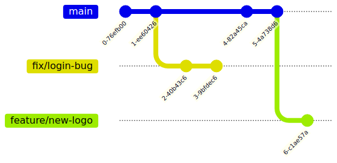

!SLIDE smbullets noprint
# Feature Branch Workflow

* Development happens in named branches
* Does not interfere with the main codebase
* Main branch does not contain broken code
* Branches can be rebased against the main branch on demand

!SLIDE smbullets printonly
# Feature Branch Workflow

* Feature development happens in named branches
* Does not interfere with the main codebase
* Main branch does not contain broken code
* Branches can be rebased against stable main branch on demand

!SLIDE smbullets
# Feature Branch Workflow - How it works

* Create a new branch every time you start new work
* Use descriptive branch names (`feature/new-login`, `fix/db-error`)
* Changes in a branch are similar to the centralized workflow
* Push branches to central repository for collaboration with other developers

!SLIDE smbullets
# Lab ~~~SECTION:MAJOR~~~.~~~SECTION:MINOR~~~: Use Feature Branches

* Objective:
 * Create a new feature branch `feature/docs-workflows`
* Steps:
 * Change into `$HOME/training`
 * Use `git checkout -b feature/docs-workflows` to create a new feature branch based on the main
 * Add and commit changes
 * Push the branch to your central repository

!SLIDE supplemental exercises
# Lab ~~~SECTION:MAJOR~~~.~~~SECTION:MINOR~~~: Use Feature Branches

## Objective: Create a new feature branch
****

* Create a new feature branch

## Steps:

****

* Change into `$HOME/training`
* Use `git checkout -b feature/docs-workflows` to create a new feature branch based on the main
* Add and commit changes
* Push the branch to your central repository

!SLIDE supplemental solutions
# Lab ~~~SECTION:MAJOR~~~.~~~SECTION:MINOR~~~: Proposed Solution
****

## Use Feature Branches

****

### Create a new branch

The new branch `feature/docs-workflows` will be based on the `main` branch.

    @@@ Sh
    $ cd $HOME/training
    $ git checkout main
    $ git checkout -b feature/docs-workflows

### Add and commit changes

    @@@ Sh
    $ vim README.md

    ## Workflows

    Central Workflow and now feature workflows with descriptive branch names.

    $ git add README.md
    $ git commit -v README.md -m "Update docs for Git workflows"

### Push your feature branch

    @@@ Sh
    $ git push -u origin feature/docs-workflows

!SLIDE smbullets
# Lab ~~~SECTION:MAJOR~~~.~~~SECTION:MINOR~~~: Merge Feature Branches

* Objective:
 * Update `main` branch and merge feature branch `feature/docs-workflows`

* Steps:
 * Checkout the feature branch `feature/docs-workflows`
 * Edit `README.md`, add and commit the changes
 * Diff the feature branch to the current main with `git diff main`
 * Checkout the `main` branch, merge the feature branch as non-fast-forward with `--no-ff`
 * Show the history tree with `tig` or inside GitLab and explain why the forced merge commit with `--no-ff` is important

!SLIDE supplemental exercises
# Lab ~~~SECTION:MAJOR~~~.~~~SECTION:MINOR~~~: Merge Feature Branches

## Objective: Merge Feature Branches
****

* Update main branch and merge feature branch

## Steps:

****

* Change into `$HOME/training`
* Checkout the feature branch `feature/docs-workflows`
* Edit `README.md`, add and commit the changes
* Diff the feature branch to the current main with `git diff main`
* Checkout the `main` branch
* Merge the feature branch as non-fast-forward with `--no-ff`
* Show the history tree with `tig` or inside GitLab

## Bonus:

****

 * Explain why the forced merge commit with `--no-ff` is important

!SLIDE supplemental solutions
# Lab ~~~SECTION:MAJOR~~~.~~~SECTION:MINOR~~~: Proposed Solution
****

## Merge Feature Branches

****

### Checkout the feature branch and add a commit

    @@@ Sh
    $ cd $HOME/training
    $ git checkout feature/docs-workflows
    $ vim README.md

    I'm learning about workflows today.

    $ git add README.md
    $ git commit -v README.md -m "Update docs for workflows"
    $ git push origin feature/docs-workflows

### Checkout the feature branch and compare it with the main branch

    @@@ Sh
    $ git branch
    $ git checkout feature/docs-workflows
    $ git diff main feature/docs

### Checkout the main and merge the feature branch

    @@@ Sh
    $ git checkout main
    $ git merge --no-ff feature/docs-workflows

    In this commit message, I may add a reference to a GitLab issue like this
    to automatically resolve it after merge.

    fixes #12

### Examine the history

    @@@ Sh
    $ tig
