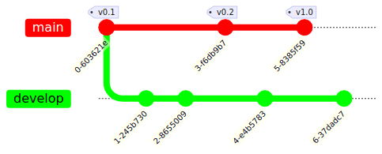
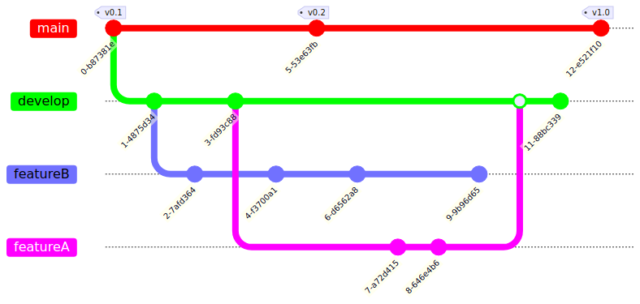
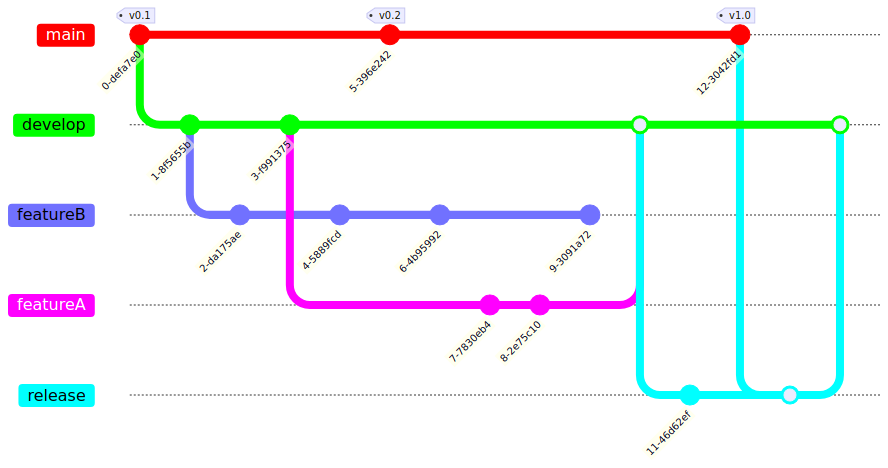
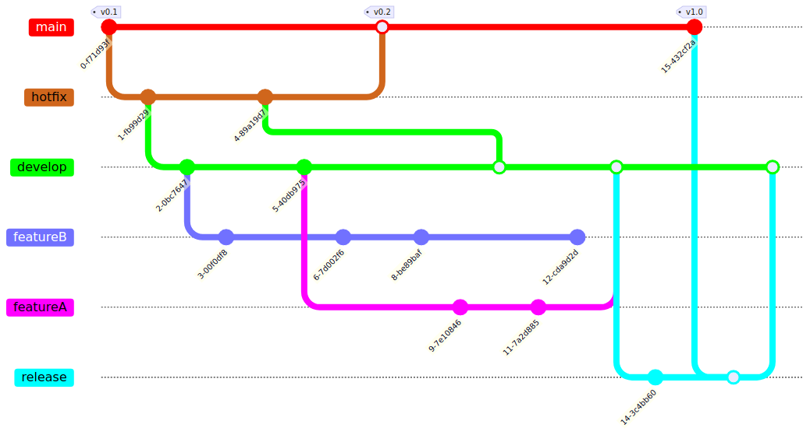

!SLIDE smbullets
# Gitflow Workflow

Gitflow is a strict branching model for larger projects

* Based on Feature Branch Workflow
* It assigns roles to different branches
* Defines interaction between branches for releases

!SLIDE smbullets noprint
# Gitflow Workflow - Historical Branches

* Main branch for release history (including version tags)
* Main branch is always `stable` and in production
* Develop branch for feature integration

!SLIDE smbullets printonly
# Gitflow Workflow - Historical Branches

* Main branch for release history (including version tags)
* Main branch is always `stable` and in production
* Development branch for feature integration

!SLIDE smbullets noprint
# Gitflow Workflow - Feature Branches

* New features in their own branches
* Feature branches use `develop` as their parent branch
* Once completed, merged back to `develop`

!SLIDE smbullets printonly
# Gitflow Workflow - Feature Branches

* New features in their own branches
* Feature branches use `develop` as their parent branch
* Once completed, merged back to `develop`

!SLIDE smbullets noprint
# Gitflow Workflow - Release Branches

* Enough features in `develop`: `release` branch based on `develop`
* Ready to ship: merged to `main` and tagged with version

!SLIDE smbullets printonly
# Gitflow Workflow - Release Branches

* Enough features in `develop`: `release` branch based on `develop`
* Ready to ship: merged to `main` and tagged with version

!SLIDE smbullets noprint
# Gitflow Workflow - Maintenance Branches

* Fixes based on `main`
* Merged to `main`, tagged and merged to `develop`

!SLIDE smbullets printonly
# Gitflow Workflow - Maintenance Branches

* Fixes based on `main`
* Merged to `main`, tagged and merged to `develop`

