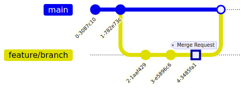

!SLIDE smbullets noprint
# GitLab Workflow

A workflow similar to feature branches.

* Manage branch access with roles and permissions
* Create `Merge Requests` from branches, CI runs tests/builds automatically
* Review and inline code comments
* Project maintainer merges requests and manages issues/milestones/releases

!SLIDE smbullets printonly
# GitLab Workflow

* Manage branch access with roles and permissions
* Create `Merge Requests` from branches, CI runs tests/builds automatically
* Review and inline code comments
* Project maintainer merges requests and manages issues/milestones/releases

!SLIDE supplemental solutions
# Lab ~~~SECTION:MAJOR~~~.~~~SECTION:MINOR~~~: Proposed Solution
****

## Create Milestone and First Issue

****

Follow the instructions and ask the trainer for help.

!SLIDE smbullets
# Lab ~~~SECTION:MAJOR~~~.~~~SECTION:MINOR~~~: Create Merge Request

* Objective:
 * Create merge request from feature branch

* Steps:
 * Create/checkout the branch `feature/docs-merge-request`
 * Edit `README.md`, add, commit and push the changes
 * Open the proposed GitLab URL in your browser
 * Fill in the merge request and add `fixes #1` as description
 * Merge the MR and tick `delete source branch`
 * Analyze the history in GitLab and open issue #1

* Bonus:
 * Run `git fetch --prune` and `git branch -d feature/docs-merge-request`

~~~SECTION:handouts~~~

****

For future branch cleanups, you'll need to compare the deleted
remote branch references from `git fetch --prune` with the local
branch names, review them and then delete them.

    @@@Sh
    $ git branch -vv | grep 'origin/.*: gone]' | awk '{print $1}'
    $ git branch -vv | grep 'origin/.*: gone]' | awk '{print $1}' | xargs git branch -d

~~~ENDSECTION~~~

!SLIDE supplemental exercises
# Lab ~~~SECTION:MAJOR~~~.~~~SECTION:MINOR~~~: Create Merge Request

## Objective: Create Merge Request
****

* Create Merge Request

## Steps:

****

* Create/checkout the branch `feature/docs-merge-request`
* Edit `README.md`, add, commit and push the changes
* Open the proposed GitLab URL in your browser
* Fill in the merge request and add `fixes #1` as description
* Merge the MR and tick `delect source branch`
* Analyze the history in GitLab and open issue #1

## Bonus:

****

* Run `git fetch --prune` and `git branch -d feature/docs-merge-request`

!SLIDE supplemental solutions
# Lab ~~~SECTION:MAJOR~~~.~~~SECTION:MINOR~~~: Proposed Solution
****

## Create Merge Request

****

### Checkout the feature branch, add, commit and push changes

    @@@ Sh
    $ cd $HOME/training
    $ git checkout main
    $ git checkout -b feature/docs-merge-request
    $ vim README.md

    Let's create a merge request with GitLab.

    $ git add README.md
    $ git commit -v README.md -m "Update docs for merge requests"
    $ git push -u origin feature/docs-merge-request

### Navigate into GitLab and create merge request

GitLab puts the URL into the shell output when pushing the branch.

    @@@ Sh
    $ git push -u origin feature/docs-merge-request
    Total 6 (delta 4), reused 0 (delta 0)
    remote: To create a merge request for feature/docs-merge-request, visit:
    remote:   https://[...].nws.netways.de/root/training/merge_requests/new?merge_request%5Bsource_branch%5D=feature%2Fdocs-merge-request
    To https://[...].nws.netways.de/root/training.git
     * [new branch]      feature/docs-merge-request -> feature/docs-merge-request
    Branch 'feature/docs-merge-request' set up to track remote branch 'feature/docs-merge-request' from 'origin'.

Open the URL in your browser.

Specify a topic and description. Add `fixes #1` into the MR's description.

Create the merge request. Add a comment inline to the source code
and see what happens in the interface.

Merge the MR and tick `delete source branch`.

Open the previously created issue and verify that is was closed
by merging the MR.

### Update local index and delete the branch

    @@@ Sh
    $ git fetch --prune
    $ git branch -d feature/docs-merge-request

### Pull changes to local main after merge

    @@@ Sh
    $ git checkout main
    $ git pull

!SLIDE smbullets
# Forking Repositories

A Fork is a server-side copy of a repository.

If you have no write access to a repository you can fork it. Then:

* Commit and push into the copy
* Create a `Merge/Pull Request` in the original repo
* Maintainers of the original repo can review and then merge your changes

GitLab and GitHub support creating forks.

~~~SECTION:handouts~~~

****

References:

* GitHub: https://guides.github.com/introduction/flow/
* GitLab: https://docs.gitlab.com/ce/workflow/forking_workflow.html

~~~ENDSECTION~~~
