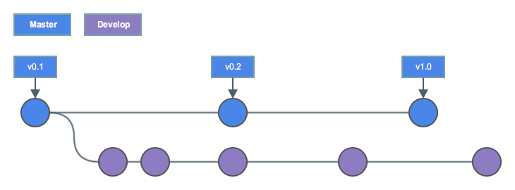
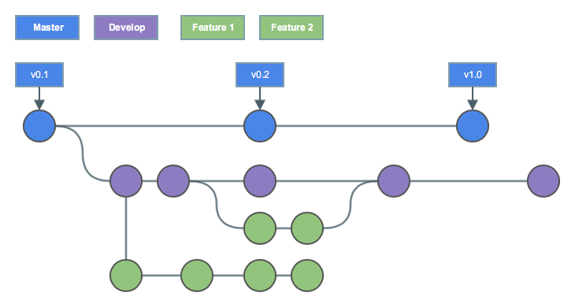
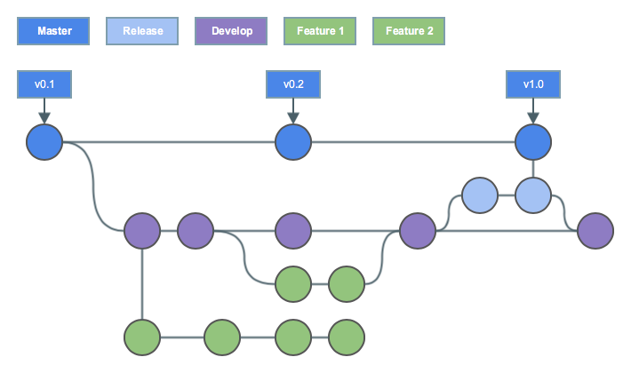
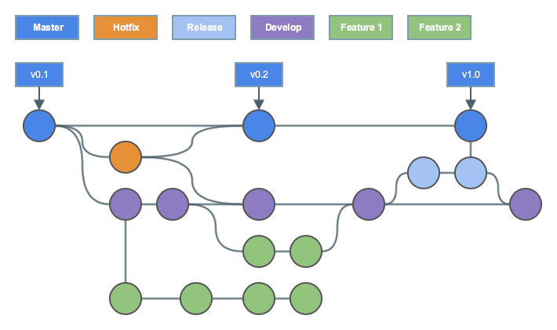

!SLIDE smbullets
# Gitflow Workflow

Gitflow is a strict branching model for larger projects

* Based on Feature Branch Workflow
* It assigns roles to different branches
* Defines interaction between branches for releases

!SLIDE smbullets noprint
# Gitflow Workflow - Historical Branches

The main branch is used for release history (including version tags).

* The main branch is always `stable` and in production
* A development branch is used for feature integration

!SLIDE smbullets printonly
# Gitflow Workflow - Historical Branches

The main branch is used for release history (including version tags).

* The main branch is always `stable` and in production
* A development branch is used for feature integration

!SLIDE smbullets noprint
# Gitflow Workflow - Feature Branches

Development happens on feature branches.

* Feature branches use the development branch as their parent
* Once development is completed, they are merged

!SLIDE smbullets printonly
# Gitflow Workflow - Feature Branches

Development happens on feature branches.

* Feature branches use the development branch as their parent
* Once development is completed, they are merged to `develop`

!SLIDE smbullets noprint
# Gitflow Workflow - Release Branches

New releases are prepared on a temporary release branch.

* Release branches use the development branch as their parent
* Preparation happens on the release branch, they are then merged to `main`

!SLIDE smbullets printonly
# Gitflow Workflow - Release Branches

New releases are prepared on a temporary release branch.

* Release branches use the development branch as their parent
* Release preparation happens on the release branch
* Once the release is ready, they are merged to `main`

!SLIDE smbullets noprint
# Gitflow Workflow - Maintenance Branches

Maintenance/hotfix branches are used to quickly patch releases.

* Hotfix branches the `main` branch as their parent
* Hotfix branches are merged into `main`, tagged and also merged into `develop`

!SLIDE smbullets printonly
# Gitflow Workflow - Maintenance Branches

Maintenance/hotfix branches are used to quickly patch releases.

* Hotfix branches the `main` branch as their parent
* Hotfix branches are merged into `main`, tagged and also merged into `develop`

