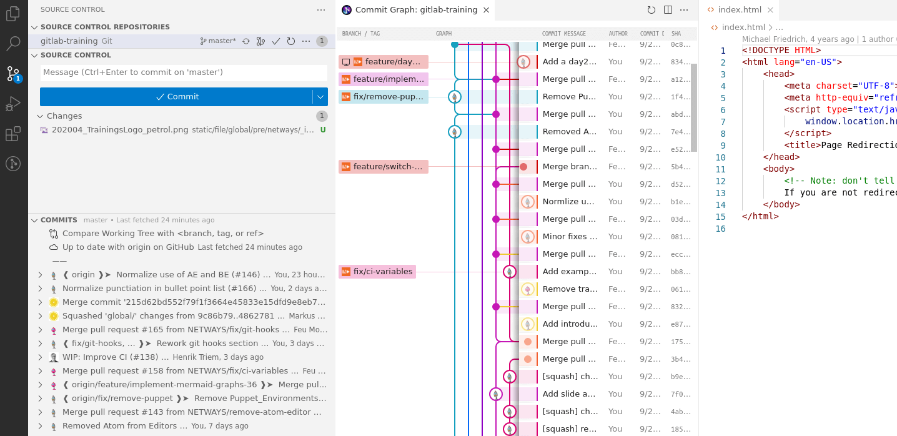

!SLIDE smbullets
# IDEs

* Atom
* JetBrains PHPStorm, ...
* Visual Studio
* Eclipse
* vim

~~~SECTION:handouts~~~

****

* Eclipse egit: http://www.eclipse.org/egit/
* vim-fugitive: https://github.com/tpope/vim-fugitive

~~~ENDSECTION~~~

!SLIDE smbullets noprint
# Atom

* Line diffs, tree view, etc.
* Default editor for command line commits
* GitHub integration with Pull Requests

!SLIDE smbullets printonly
# Atom

* Line diffs, tree view, etc.
* Default editor for command line commits
* GitHub integration with Pull Requests

~~~SECTION:handouts~~~

****

References:

http://blog.atom.io/2014/03/13/git-integration.html
http://blog.atom.io/2017/05/16/git-and-github-integration-comes-to-atom.html

~~~ENDSECTION~~~

!SLIDE smbullets noprint
# JetBrains

* Status and change tracking
* Add, commit, fetch, push, pull, etc.
* GitHub integration

!SLIDE smbullets printonly
# JetBrains

* Status and change tracking
* Add, commit, fetch, push, pull, etc.
* GitHub integration

~~~SECTION:handouts~~~

****

Reference: https://www.jetbrains.com/help/idea/using-git-integration.html

~~~ENDSECTION~~~

!SLIDE smbullets noprint
# Visual Studio

* Git for Windows bundled in 2015+
* Native GUI integration

!SLIDE smbullets printonly
# Visual Studio

* Git for Windows bundled in 2015+
* Native GUI integration

~~~SECTION:handouts~~~

****

References:

* https://docs.microsoft.com/en-us/vsts/git/gitquickstart?tabs=visual-studio
* https://visualstudio.github.com/

~~~ENDSECTION~~~
