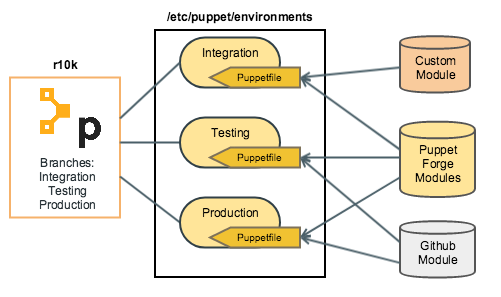

!SLIDE smbullets
# Puppet Environments

* Multiple Puppet environments (prod, stage, ...)
* Git branches for each environment
* Different module versions and configuration for each environment
* Automated deployment with r10k

r10k is a toolset provided by Puppet for deploying environments and modules.

~~~SECTION:handouts~~~

****

Reference blog post (German): https://blog.netways.de/2014/11/07/git-workflow-bei-puppet-mit-r10k/

Puppet environments and r10k are part of the "Scaling Puppet" training:
https://www.netways.de/en/events_trainings/puppet_trainings/scaling_puppet/

~~~ENDSECTION~~~

!SLIDE smbullets noprint
# Puppet Environments: r10k

!SLIDE smbullets printonly
# Puppet Environments: r10k

