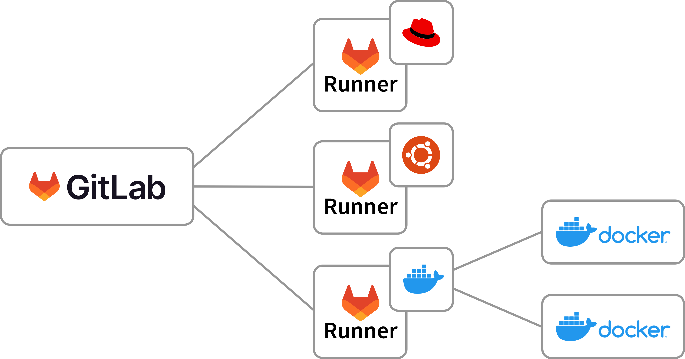

!SLIDE smbullets
# Continuous Integration: GitLab CI

* Build Pipelines
* Natively integrated into GitLab
* Invokes GitLab Runners
* Local container registry for runners


~~~SECTION:handouts~~~

****

Documentation: https://docs.gitlab.com/ce/ci/README.html

Reference example (German): https://blog.netways.de/2017/05/03/gitlab-ce-continuous-integration-jobs-and-runners/

~~~ENDSECTION~~~

!SLIDE smbullets
# GitLab CI: Introduction

* `.gitlab-ci.yml` configuration file in Git repository
* Runner is triggered on specific events, e.g. `git push`
* Jobs can be run on-demand
* Built-in and external runners
* Container registry enabled for the project (optional)


~~~SECTION:handouts~~~

****

Documentation references:

https://docs.gitlab.com/ce/user/project/container_registry.html

~~~ENDSECTION~~~


!SLIDE smbullets
# GitLab Runners

* Written in Go
* Linux/Unix, macOS, Windows, Docker support
* Run multiple jobs in parallel
* Run jobs locally, in Docker containers, remote via SSH
* Can run Bash, Windows Batch/Powershell


~~~SECTION:handouts~~~

****

Documentation reference: https://docs.gitlab.com/runner/

~~~ENDSECTION~~~


!SLIDE smbullets
# GitLab Runners: Installation and Configuration

* Separate server
* Installation via package repository
* `gitlab-runner register`

Note: This is not needed for the built-in `docker executor` runner.

~~~SECTION:handouts~~~

****

Documentation References:

https://docs.gitlab.com/runner/install/linux-repository.html
https://docs.gitlab.com/runner/register/index.html

~~~ENDSECTION~~~


!SLIDE smbullets
# GitLab CI: Container Registry

* Enable the Container Registry (administration server setting)
* Enable the Container Registry for the project
* Advanced usage only

~~~SECTION:handouts~~~

****

```
# vim /etc/gitlab/gitlab.rb

registry_external_url 'https://gitlab.example.com:5000'

# gitlab-ctl reconfigure
```

Documentation References:

https://docs.gitlab.com/ce/user/project/container_registry.html
https://docs.gitlab.com/ce/administration/container_registry.html
~~~ENDSECTION~~~


!SLIDE smbullets
# GitLab CI: Docker, Containers - what's that?

docker.com:

"Docker is an open platform for developers and sysadmins to build, ship, and run distributed applications. Consisting of Docker Engine, a portable, lightweight runtime and packaging tool, and Docker Hub, a cloud service for sharing applications and automating workflows, Docker enables apps to be quickly assembled from components and eliminates the friction between development, QA, and production environments. As a result, IT can ship faster and run the same app, unchanged, on laptops, data center VMs, and any cloud."


~~~SECTION:handouts~~~

****

Documentation References:


https://docs.docker.com


~~~ENDSECTION~~~

!SLIDE smbullets
# GitLab CI: Docker, Containers - how to use it

* Run an application in an isolated environment
* Layered images providing additional libraries and tools, e.g. base linux, mysql, apache, ruby
* Start container, run tests, return results
* Light-weight and fast, can run on each Git push
* Reliable same run each time, container is destroyed on stop


~~~SECTION:handouts~~~

****

Documentation References:

https://docs.docker.com


~~~ENDSECTION~~~

!SLIDE smbullets noprint
# GitLab CI: Docker and CI Runners

<center></center>

!SLIDE smbullets printonly
# GitLab CI: Docker and CI Runners

<center></center>

~~~SECTION:handouts~~~

****

Documentation References:

https://docs.docker.com
https://docs.gitlab.com/runner/install/docker.html

~~~ENDSECTION~~~


!SLIDE smbullets
# Lab ~~~SECTION:MAJOR~~~.~~~SECTION:MINOR~~~: Get CI Runner Token

* Objective:
 * Get CI Runner Token
* Steps:
 * Navigate to Admin > Overview > Runners
 * Inspect and copy the token


~~~SECTION:handouts~~~

****

Reference: https://gitlab.com/gitlab-org/gitlab-runner/blob/master/docs/install/linux-repository.md


~~~ENDSECTION~~~

!SLIDE supplemental exercises
# Lab ~~~SECTION:MAJOR~~~.~~~SECTION:MINOR~~~: Get CI Runner Token

## Get CI Runner Token
****

* Use the GitLab Admin UI to get the token

## Steps:

* Navigate to Admin > Overview > Runners
* Inspect and copy the token


!SLIDE supplemental solutions
# Lab ~~~SECTION:MAJOR~~~.~~~SECTION:MINOR~~~: Proposed Solution
****

## Open Runner Administration View

****

http://192.168.56.101/admin/runners

```
How to setup a shared Runner for a new project
Install a Runner compatible with GitLab CI (checkout the GitLab Runner section for information on how to install it).
Specify the following URL during the Runner setup: ...
Use the following registration token during setup: ...
Start the Runner!
```

### Runners

Registered runners are listed at the bottom.


!SLIDE smbullets
# Lab ~~~SECTION:MAJOR~~~.~~~SECTION:MINOR~~~: Register CI Runner

* Objective:
 * Register CI runner
* Steps:
 * Run `gitlab-runner register` as root
 * Use `http://192.168.56.101` as host
 * Paste the token
 * Add description `training01` and tag `training`
 * Untagged builds: `true`, Lock to current project: `false`
 * Executor: `docker`, Default: `alpine/latest` 

Note: Packages are pre-installed in the VM.

~~~SECTION:handouts~~~

****

Reference: https://gitlab.com/gitlab-org/gitlab-runner/blob/master/docs/install/linux-repository.md
Reference: https://docs.gitlab.com/runner/install/linux-repository.html

Reference for Docker: https://docs.docker.com/engine/installation/linux/docker-ce/ubuntu/

Example on Ubuntu:

```
apt-get install \
    apt-transport-https \
    ca-certificates \
    curl \
    software-properties-common

curl -fsSL https://download.docker.com/linux/ubuntu/gpg | sudo apt-key add -

add-apt-repository \
   "deb [arch=amd64] https://download.docker.com/linux/ubuntu \
   $(lsb_release -cs) \
   stable"

apt-get update
apt-get install docker-ce
```

```
curl -L https://packages.gitlab.com/install/repositories/runner/gitlab-runner/script.deb.sh | sudo bash
apt-get install gitlab-runner
```

~~~ENDSECTION~~~

!SLIDE supplemental exercises
# Lab ~~~SECTION:MAJOR~~~.~~~SECTION:MINOR~~~: Register CI Runner

## Register CI Runner
****

* Register CI Runner with the previously copied token

## Steps:

* Run `gitlab-runner register` as root
* Use `http://192.168.56.101` as host
* Paste the token
* Add description `training01` and tag `training`
* Untagged builds: `true`, Lock to current project: `false`
* Executor: `docker`, Default: `alpine/latest` 


!SLIDE supplemental solutions
# Lab ~~~SECTION:MAJOR~~~.~~~SECTION:MINOR~~~: Proposed Solution
****

## Register CI Runner

****

### Start CLI

    @@@ Sh
    # gitlab-runner register
    Running in system-mode.
 
    Please enter the gitlab-ci coordinator URL (e.g. https://gitlab.com/):
    http://192.168.56.101

    Please enter the gitlab-ci token for this runner:
    Do1aqTvPiiBj6_u_u5Ye

    Please enter the gitlab-ci description for this runner:
    [ubuntu-16]: training01

    Please enter the gitlab-ci tags for this runner (comma separated):
    training

    Whether to run untagged builds [true/false]:
    [false]: true

    Whether to lock the Runner to current project [true/false]:
    [true]: false
    Registering runner... succeeded                     runner=Do1aqTvP

    Please enter the executor: docker+machine, docker-ssh, parallels, ssh, virtualbox, docker, shell, docker-ssh+machine, kubernetes:
    docker

    Please enter the default Docker image (e.g. ruby:2.1):
    alpine:latest

    Runner registered successfully. Feel free to start it, but if it's running already the config should be automatically reloaded!

!SLIDE smbullets
# GitLab CI: Configuration in .gitlab-ci.yml

* image
* services
* all_tests

Example:

    image: alpine:latest

    all_tests:
      script:
        - exit 1

~~~SECTION:handouts~~~

****

Documentation References:

https://about.gitlab.com/2016/03/01/gitlab-runner-with-docker/


~~~ENDSECTION~~~

!SLIDE smbullets
# Lab ~~~SECTION:MAJOR~~~.~~~SECTION:MINOR~~~: Create .gitlab-ci.yml

* Objective:
 * Create CI configuration for the training project
* Steps:
 * Create the `.gitlab-ci.yml` file in the `training` directory (vim, nano, etc.)
 * Add `image: alpine/latest` to specify base image
 * `all_tests` specifies `script` as array element, which itself runs `exit 1`


~~~SECTION:handouts~~~

****

~~~ENDSECTION~~~

!SLIDE supplemental exercises
# Lab ~~~SECTION:MAJOR~~~.~~~SECTION:MINOR~~~: Create .gitlab-ci.yml

## Create CI configuration
****

* Create CI configuration file .gitlab-ci.yml

## Steps:

* Create the `.gitlab-ci.yml` file in the `training` directory (vim, nano, etc.)
* Add `image: alpine/latest` to specify base image
* `all_tests` specifies `script` as array element, which itself runs `exit 1`

!SLIDE supplemental solutions
# Lab ~~~SECTION:MAJOR~~~.~~~SECTION:MINOR~~~: Proposed Solution
****

## Create .gitlab-ci.yml file

****

### Create CI configuration file

    @@@ Sh
    $ cd training
    $ vim .gitlab-ci.yml

    image: alpine:latest

    all_tests:
      script:
        - exit 1

The script will always fail. We will use different exit states to fix it.
Future examples and tests work the same way.


!SLIDE smbullets
# Lab ~~~SECTION:MAJOR~~~.~~~SECTION:MINOR~~~: Push to GitLab

* Objective:
 * Add .gitlab-ci.yml to Git and push to GitLab
* Steps:
 * Use `git add .gitlab-ci.yml` and commit the change
 * Push the commit into the remote repository
 * Navigate to the project into `CI / CD` and verify the running job
* Bonus
 * Modify the exit code to `0`, add, commit, push and verify again

~~~SECTION:handouts~~~

****

~~~ENDSECTION~~~

!SLIDE supplemental exercises
# Lab ~~~SECTION:MAJOR~~~.~~~SECTION:MINOR~~~: Push to GitLab

## Push CI config and trigger GitLab job
****

* Add .gitlab-ci.yml to Git and push to GitLab

## Steps:

* Use `git add .gitlab-ci.yml` and commit the change
* Push the commit into the remote repository
* Navigate to the project into `CI / CD` and verify the running job

## Bonus:

* Modify the exit code to `0`, add, commit, push and verify again

!SLIDE supplemental solutions
# Lab ~~~SECTION:MAJOR~~~.~~~SECTION:MINOR~~~: Proposed Solution
****

## Push CI config and trigger GitLab job

****

### Git Add, Commit, Push

    @@@ Sh
    $ git add .gitlab-ci.yml
    $ git commit -av -m "Add GitLab CI config"
    $ git push origin master

### Modify exit code

    @@@ Sh
    $ vim .gitlab-ci.yml

    image: alpine:latest

    all_tests:
      script:
        - exit 0


!SLIDE smbullets
# GitLab CI: .gitlab-ci.yml Templates

* Repository: https://gitlab.com/gitlab-org/gitlab-ci-yml
 * PHP: https://gitlab.com/gitlab-org/gitlab-ci-yml/blob/master/PHP.gitlab-ci.yml
 * Python: https://gitlab.com/gitlab-org/gitlab-ci-yml/blob/master/Python.gitlab-ci.yml
 * C++: https://gitlab.com/gitlab-org/gitlab-ci-yml/blob/master/C++.gitlab-ci.yml
 * ...

~~~SECTION:handouts~~~

****

Documentation References:

https://docs.gitlab.com/ce/ci/README.html#examples

https://gitlab.com/gitlab-org/gitlab-ci-yml


~~~ENDSECTION~~~

!SLIDE smbullets
# Lab ~~~SECTION:MAJOR~~~.~~~SECTION:MINOR~~~: 

TODO

* Use `services`
* Add script which runs some simple tests (py, php)
* More foo to play around

* Objective:
 * 
* Steps:
 * 

~~~SECTION:handouts~~~

****

Reference: https://docs.gitlab.com/ce/ci/services/README.html

~~~ENDSECTION~~~

!SLIDE supplemental exercises
# Lab ~~~SECTION:MAJOR~~~.~~~SECTION:MINOR~~~: 

## 
****

* 

## Steps:

*

!SLIDE supplemental solutions
# Lab ~~~SECTION:MAJOR~~~.~~~SECTION:MINOR~~~: Proposed Solution
****

## 

****

### 

    @@@ Sh
    $


!SLIDE smbullets
# Lab ~~~SECTION:MAJOR~~~.~~~SECTION:MINOR~~~:

* Objective:
 * 
* Steps:
 * 

~~~SECTION:handouts~~~

****

~~~ENDSECTION~~~

!SLIDE supplemental exercises
# Lab ~~~SECTION:MAJOR~~~.~~~SECTION:MINOR~~~: 

## 
****

* 

## Steps:

*

!SLIDE supplemental solutions
# Lab ~~~SECTION:MAJOR~~~.~~~SECTION:MINOR~~~: Proposed Solution
****

## 

****

### 

    @@@ Sh
    $


