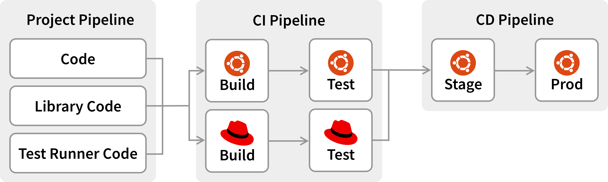

!SLIDE smbullets
# GitLab Pipelines

Pipelines are the top-level component of continuous integration.

* Jobs, which define what to do.
* Stages, which define when to run the jobs.
  * If all jobs in a stage succeed, the pipeline moves forward
  * If any job in a stage fails, the pipeline ends early

Example:

    Clone Code => Test => Build => Deploy

~~~SECTION:handouts~~~

****

Reference:

https://docs.gitlab.com/ee/ci/pipelines/

~~~ENDSECTION~~~

!SLIDE smbullets noprint
# GitLab Pipelines: Basic Pipelines

* Runs all steps in stage concurrently before starting next stage
* Not the most efficient
* Easy to maintain

!SLIDE smbullets printonly
# GitLab Pipelines: Example

!SLIDE smbullets
# Lab ~~~SECTION:MAJOR~~~.~~~SECTION:MINOR~~~: CI: Pipelines

* Objective:
 * Build a job pipeline with stages
* Steps:
 * Edit the `.gitlab-ci.yml` and add `stages`
 * Place your jobs in stages using `stage:`

Example:

    stages:
      - test
      - build

    all_tests:
      stage: test

    markdown:
      stage: build

~~~SECTION:handouts~~~

****

Documentation: https://docs.gitlab.com/ce/ci/yaml/README.html#stage

~~~ENDSECTION~~~

!SLIDE supplemental exercises
# Lab ~~~SECTION:MAJOR~~~.~~~SECTION:MINOR~~~: CI: Pipelines

## Create HTML docs from Markdown
****

* Build a job pipeline with stages

## Steps:

* Edit .gitlab-ci.yml and add stages
* Add jobs to stages
* Commit the changes
* Check the GitLab Job Pipelines

!SLIDE supplemental solutions
# Lab ~~~SECTION:MAJOR~~~.~~~SECTION:MINOR~~~: Proposed Solution
****

## Build a job pipeline with stages

****

### Edit .gitlab-ci.yml and add stages

    @@@ Sh
    $ vim .gitlab-ci.yml

    stages:
      - test
      - build

### Add jobs to stages

    @@@ Sh
    $ vim .gitlab-ci.yml

    ...

    all_tests:
      stage: test

    ...

    markdown:
      stage: build

### Complete example

    @@@ Sh
    $ vim .gitlab-ci.yml

    image: alpine:latest

    before_script:
      - apk update && apk add python py-pip
      - pip install markdown Pygments

    stages:
      - test
      - build

    all_tests:
      stage: test
      script:
        - exit 0

    markdown:
      stage: build
      script:
        - python -m markdown README.md > README.html
      artifacts:
        paths:
        - README.html
        expire_in: 1 week

### Commit and push the changes

    @@@ Sh
    $ git commit -av -m "CI: Add pipelines"
    $ git push

### Check the GitLab Job Pipelines

This is an example of how to do it from a CLI, the Gitlab WebIDE is an obvious alternative.

!SLIDE smbullets
# GitLab Pipelines: Directed Acyclic Graph Pipelines

Instead of stages we can use the `needs` keyword to define dependencies between jobs

* Builds relationships between jobs
* Ignore stage ordering and run some jobs without waiting for others

Example:

    build_a:
      stage: build
      script:
        - echo "This job builds something quickly."

    test_a:
      stage: test
      needs: [build_a]
      script:
        - echo "This test job will start as soon as build_a finishes."

!SLIDE smbullets
# Pipeline schedules

Pipeline schedules can be used to also run pipelines at specific intervals.

* Pipelines are normally run based on certain conditions being met
* Navigate to `CI / CD > Schedules` to create a new pipeline
* Pipelines can be scheduled using Cron syntax

Try it out with the trainer.

!SLIDE smbullets
# GitLab Pipelines: Triggers

We can use the `trigger` keyword to start other pipelines:

* Multi-project pipeline
* Child pipeline

Example:

    stages:
      - test
    run_a_jobs:
      stage: test
      trigger:
        include: a/.gitlab-ci.yml
      rules:
        - changes:
            - a/*

!SLIDE smbullets small
# Lab ~~~SECTION:MAJOR~~~.~~~SECTION:MINOR~~~: CI: Pipeline Rules

* Objective:
 * Add a job to publish our HTML
* Steps:
 * Add a new job `publish`
 * Use `rules` to start this job only when we add tags
 * Use `needs` to add a dependency on the `build` job
 * Use `release` to add a release for the `build` job

Example:

    publish:
      needs: [build]
      script:
        - echo README.html
      rules:
        - if: $CI_COMMIT_TAG
      release:
        tag_name: '$CI_COMMIT_TAG'
        description: "The End of the Training Release. Hooray!"

!SLIDE supplemental exercises
# Lab ~~~SECTION:MAJOR~~~.~~~SECTION:MINOR~~~: CI: Pipeline Rules

## Add a job to publish our HTML
****

* Add a job to publish our HTML

## Steps:

 * Add a new job `publish`
 * Use `rules` to start this job only when we add tags
 * Use `needs` to add a dependency on the `build` job

!SLIDE supplemental solutions
# Lab ~~~SECTION:MAJOR~~~.~~~SECTION:MINOR~~~: Proposed Solution
****

## Add a job to publish our HTML

****

### Add a job to publish our HTML

    @@@ Sh
    publish:
      stage: publish
      needs: [build]
      script:
        - cat README.html
      rules:
        - if: $CI_COMMIT_TAG
      release:
        tag_name: '$CI_COMMIT_TAG'
        ref: '$CI_COMMIT_SHA'
        description: "This is the End of the Training Release"

---------------

!SLIDE smbullets
# Lab ~~~SECTION:MAJOR~~~.~~~SECTION:MINOR~~~: CI: Trigger Pipeline Rules

* Objective:
 * Trigger the new job by creating a Git tag
* Steps:
 * Use the Web UI to create a new tag `v1.0`
 * Verify the `publish` job

!SLIDE supplemental exercises
# Lab ~~~SECTION:MAJOR~~~.~~~SECTION:MINOR~~~: CI: Trigger Pipeline Rules

## Trigger the new job by creating a Git tag
****

* Trigger the new job by creating a Git tag

## Steps:

* Use the Web UI to create a new tag `v1.0`
* Verify the `publish` job

!SLIDE supplemental solutions
# Lab ~~~SECTION:MAJOR~~~.~~~SECTION:MINOR~~~: Proposed Solution
****

## Trigger the new job by creating a Git tag

****

### Trigger the new job by creating a Git tag

* Open GitLab and navigate into `Repository > Tags`
* Click on `New Tag` and create a new `v1.0` tag
