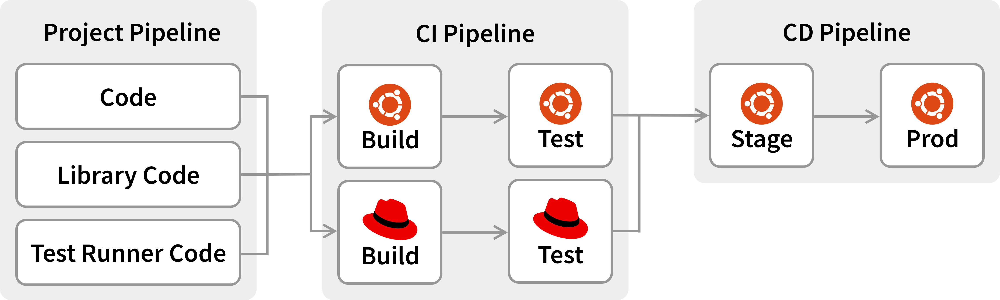
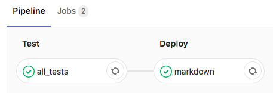
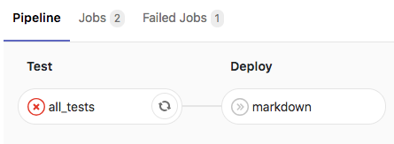

!SLIDE smbullets
# GitLab Pipelines

Code => Build => Test => Deploy

* Encapsulate QA steps into pipelines
* Visible which pipeline is affected
* Halt if one step is failing
* Direct feedback to developers
* CI and CD
  * Continuous Integration
  * Continuous Delivery

~~~SECTION:handouts~~~

****

Reference: https://docs.gitlab.com/ce/ci/pipelines.html

~~~ENDSECTION~~~

!SLIDE smbullets noprint
# GitLab Pipelines: Example

!SLIDE smbullets printonly
# GitLab Pipelines: Example

~~~SECTION:handouts~~~

****

~~~ENDSECTION~~~

!SLIDE smbullets small
# Lab ~~~SECTION:MAJOR~~~.~~~SECTION:MINOR~~~: CI: Pipelines

* Objective:
 * Build a job pipeline with stages

Example:

    stages:
      - test
      - deploy

    all_tests:
      stage: test

    markdown:
      stage: deploy

~~~SECTION:handouts~~~

****

Documentation: https://docs.gitlab.com/ce/ci/yaml/README.html#stage

~~~ENDSECTION~~~

!SLIDE supplemental exercises
# Lab ~~~SECTION:MAJOR~~~.~~~SECTION:MINOR~~~: CI: Pipelines

## Create HTML docs from Markdown
****

* Build a job pipeline with stages

## Steps:

* Edit .gitlab-ci.yml and add stages
* Add jobs to stages
* Commit and push the changes
* Check the GitLab Job Pipelines

!SLIDE supplemental solutions
# Lab ~~~SECTION:MAJOR~~~.~~~SECTION:MINOR~~~: Proposed Solution
****

## Build a job pipeline with stages

****

### Edit .gitlab-ci.yml and add stages

    @@@ Sh
    $ vim .gitlab-ci.yml

    stages:
      - test
      - deploy

### Add jobs to stages

    @@@ Sh
    $ vim .gitlab-ci.yml

    ...

    all_tests:
      stage: test

    ...

    markdown:
      stage: deploy

### Complete example

    @@@ Sh
    $ vim .gitlab-ci.yml

    image: alpine:latest

    before_script:
      - apk update && apk add python py-pip
      - pip install markdown Pygments

    stages:
      - test
      - deploy

    all_tests:
      stage: test
      script:
        - exit 0

    markdown:
      stage: deploy
      script:
        - python -m markdown README.md > README.html
      artifacts:
        paths:
        - README.html
        expire_in: 1 week

### Commit and push the changes

    @@@ Sh
    $ git commit -av -m "CI: Add pipelines"
    $ git push

### Check the GitLab Job Pipelines

!SLIDE smbullets
# Jobs, Stages, Pipelines

* Stage pipeline

* Failure: Edit the first job to `exit 1`.

~~~SECTION:handouts~~~

****

Reference: https://docs.gitlab.com/ce/ci/pipelines.html

~~~ENDSECTION~~~

