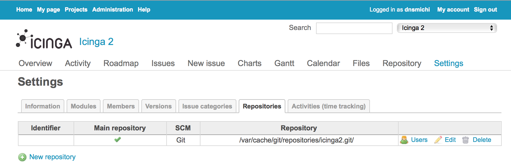
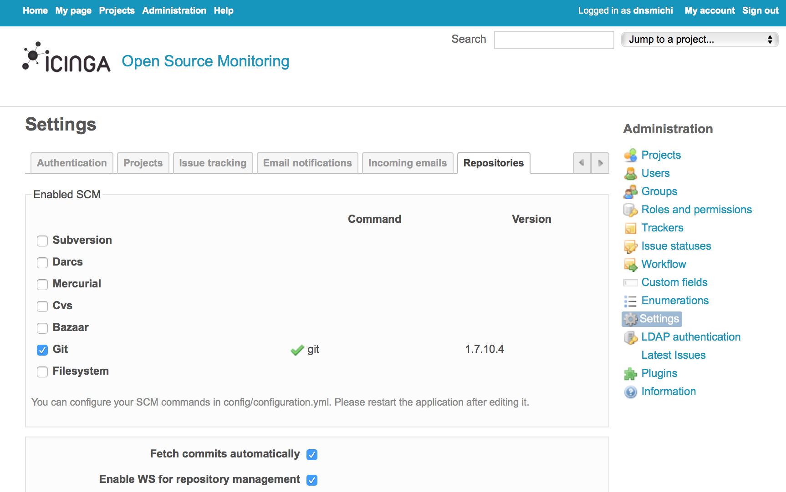
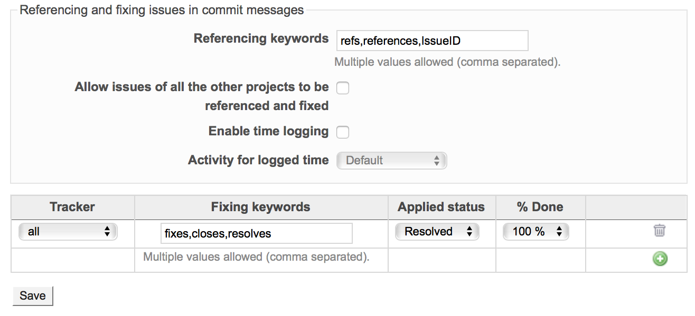

!SLIDE smbullets
# Redmine Ticketsystem Integration

* Configure a Git VCS for your Redmine project
* Define commit message patterns
 * Reference an issue
 * Auto-close an issue
* Web API for automated updates

~~~SECTION:handouts~~~

****

Cronjob example for updating the git repositories from the Web API:

    vim /etc/crontab
    */5 *   * * *   root    /usr/local/bin/redmine_git_sync > /dev/null 2>&1

    vim /usr/local/bin/redmine_git_sync

    #!/bin/sh
    
    TARGET=/tmp/redmine_git
    `wget "http://dev.icinga.org/sys/fetch_changesets?key=<REDMINEAPIKEY>" -o /dev/null -O $TARGET`
    rm $TARGET

~~~ENDSECTION~~~

!SLIDE smbullets noprint
# Redmine - Project Repository

!SLIDE smbullets printonly
# Redmine - Project Repository

!SLIDE smbullets noprint
# Redmine - Global Repository Settings

!SLIDE smbullets printonly
# Redmine - Global Repository Settings

!SLIDE smbullets noprint
# Redmine - Global Issue Resolving

!SLIDE smbullets printonly
# Redmine - Global Issue Resolving

