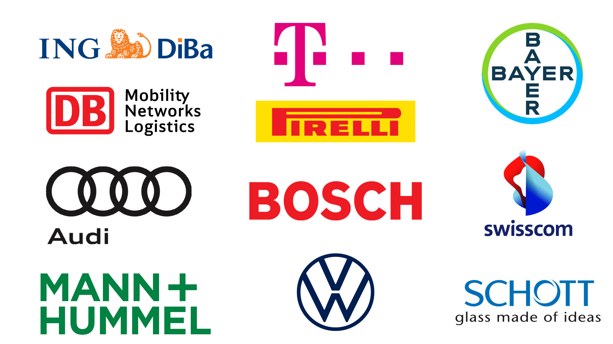
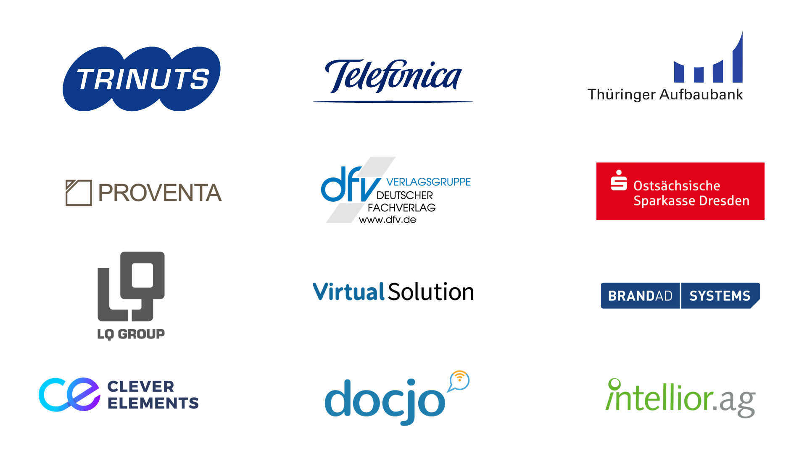

!SLIDE noprint subsectionnonum
# About NETWAYS

!SLIDE noprint
# NETWAYS

* Open Source Service Company
* Located in Nuremberg, Germany
* Services
 * Consulting
 * Outsourcing
 * Development
 * Support
 * Web Services
 * Trainings
 * Events

!SLIDE noprint
# NETWAYS Solutions

!SLIDE noprint
# NETWAYS Consulting and Outsourcing Customers

!SLIDE noprint
# NETWAYS Cloud and Hosting Customers

!SLIDE noprint
# NETWAYS Conferences & Camps

!SLIDE noprint
# NETWAYS Trainings & Workshops

