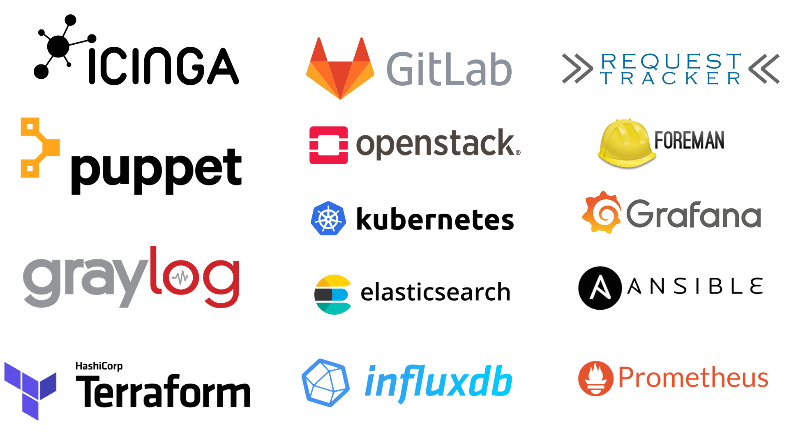

!SLIDE noprint subsectionnonum
# About NETWAYS

!SLIDE noprint
# NETWAYS

* Open Source Service Company
* Located in Nuremberg, Germany
* Services
 * Consulting
 * Hosting
 * Development
 * Support
 * Trainings
 * Conferences

!SLIDE noprint
# NETWAYS Solutions

!SLIDE noprint
# NETWAYS Consulting Customers

!SLIDE noprint
# NETWAYS Hosting Customers

!SLIDE noprint
# NETWAYS Conferences & Camps

!SLIDE noprint
# NETWAYS Trainings & Workshops

